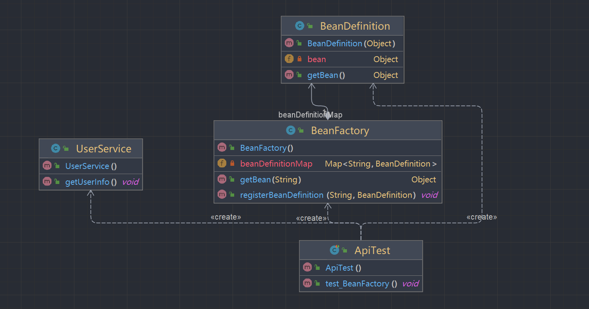

# 第一章、实现简单的bean容器

## 一、前言
> 这是第一篇文章，主要是用来简单介绍bean容器，一步一步的学习spring。首先就是需要一个容器，是Spring的核心，一切Spring bean都存储在Spring容器内，并由其通过IoC技术管理。Spring容器也就是一个bean工厂（BeanFactory）。应用中bean的实例化，获取，销毁等都是由这个bean工厂管理的。但是本次的文章不像以前的文章那样，这次的文章主要是一步一步的学习spring，目标是为了能够清晰spring结构，能够有个大概的思路，方便以后对源码的学习。
## 二、什么是bean容器
Bean容器是Spring框架的一个核心部分，它管理应用中定义的bean（对象）。这些bean是Spring应用程序的骨干，被Spring容器所创建、配置、组合以及管理。容器通过依赖注入（Dependency Injection）的方式，将这些相互依赖或协作的组件组合在一起。这样的设计方法可以降低组件之间的耦合性，并提高整体应用的灵活性和可重用性。<br />用简单的话来说就是存放对象的Map，当程序启动的时候就需要注册(使用key-value存储)到容器中，使用的时候只需要getBean就能够获取实例对象。
## 三、简单的bean容器
接下来就是简单的模拟bean容器，用简单的方式来实现bean的定义以及bean的注册和获取。
### 1、类图
如图所示，Spring Bean容器的类图<br />

<br />这里也就两个主要类：BeanDefinition和BeanFactory，这里只是简单的实现，就只是为了模拟spring中bean的注册和获取，这里的类名都和spring源码的一致。

- BeanDefinition：这个是bean的定义，目前属性就只有一个Object，用来表示实例化对象信息，通过构造器传递bean对象信息，并且通过getBean()方法来获取定义的对象。
- BeanFactory：表示Bean的工厂，里面定义了一个Map集合来存储Bean对象。
### 2、Bean定义
首先是需要对bean对象来定义，主要用途是用来定义bean的相关信息，在Spring框架中，`BeanDefinition`是非常核心的一个接口，它用于定义一个对象的配置元数据，可以理解为是针对单个Spring Bean的配方。
```java
package cn.abridge.springframework;

/**
 * @Author: lyd
 * @Date: 2024/3/19 20:40
 * @Description: bean定义，具有属性值、构造函数参数值。
 */
public class BeanDefinition {
    private Object bean;

    public BeanDefinition(Object bean) {
        this.bean = bean;
    }

    public Object getBean() {
        return bean;
    }
}
```
本次的学习就是简单的认识以下bean容器，因此这里只有一个Object来存储bean对象，我们可以到spring源码中查找这个类名`BeanDefinition`（找到的是一个接口），可以发现其里面还有`SCOPE_SINGLETON`,`SCOPE_PROTOTYPE`等等，目前只是简单实现，后续会慢慢增加。
### 3、Bean工厂
BeanFactory主要是用来生成Bean对象，在 Spring 框架中用于管理 Bean 的一个工厂接口，它提供了高级 IoC（控制反转）的支持。`BeanFactory`是 Spring IoC 容器的根接口，负责配置、创建和管理应用中的 Beans。
```java
package cn.abridge.springframework;

import java.util.Map;
import java.util.concurrent.ConcurrentHashMap;

/**
 * @Author: lyd
 * @Date: 2024/3/19 20:45
 * @Description: bean工厂
 */
public class BeanFactory {

    /** bean定义对象的集合，按bean名称键。 */
    private Map<String, BeanDefinition> beanDefinitionMap = new ConcurrentHashMap<>();

    /** 获取bean */
    public Object getBean(String name) {
        return beanDefinitionMap.get(name).getBean();
    }

    /** 注册bean到bean对象集合 */
    public void registerBeanDefinition(String name, BeanDefinition beanDefinition) {
        beanDefinitionMap.put(name, beanDefinition);
    }
}
```
这里只是简单的将bean对象进行注册（根据名称存储到Map集合中）和获取，还没有对整个bean对象的生命周期进行实现。在Spring源码中可以看到，里面包括对bean对象的获取以及判断是否单例、原型等等。
### 4、测试
首先在测试包里定义一个服务类：UserService，里面提供一个方法getUserInfo()。
```java
package cn.abridge.springframework.test.bean;

/**
 * @Author: lyd
 * @Date: 2024/3/19 20:54
 * @Description:
 */
public class UserService {
    public void getUserInfo(){
        System.out.println("获取用户信息!!!");
    }
}
```
需要通过注册bean对象，获取bean对象来执行这个方法。
```java
package cn.abridge.springframework.test;

import cn.abridge.springframework.BeanDefinition;
import cn.abridge.springframework.BeanFactory;
import cn.abridge.springframework.test.bean.UserService;
import org.junit.Test;

/**
 * @Author: lyd
 * @Date: 2024/3/19 20:54
 * @Description:
 */
public class ApiTest {

    @Test
    public void test_BeanFactory(){
        // 1.初始化 BeanFactory
        BeanFactory beanFactory = new BeanFactory();

        // 2.注册 bean
        BeanDefinition beanDefinition = new BeanDefinition(new UserService());
        beanFactory.registerBeanDefinition("userService", beanDefinition);

        // 3.获取 bean
        UserService userService = (UserService) beanFactory.getBean("userService");
        userService.getUserInfo();
    }
}

```
这里我们通过手动方式来注册bean，也是简单的实现了对bean的注册和获取。<br />运行结果
```text
获取用户信息!!!

Process finished with exit code 0
```
## 四、总结
本次也只是简单的对Spring Bean容器的一个见识，抛开一切复杂的思想来看，其简单来说就是定义存放对象，生成对象，执行对应得方法。
