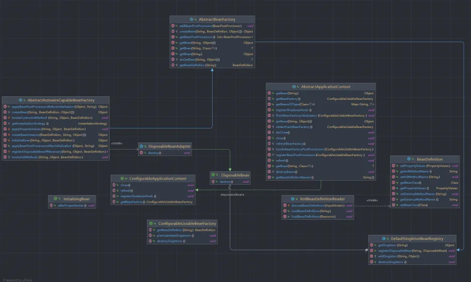
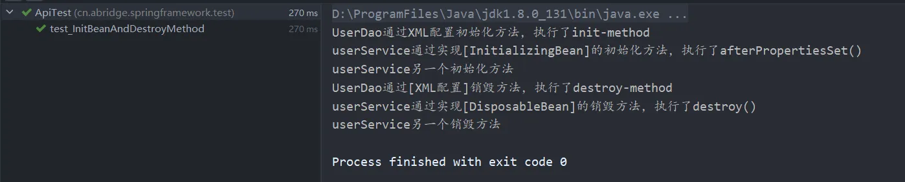
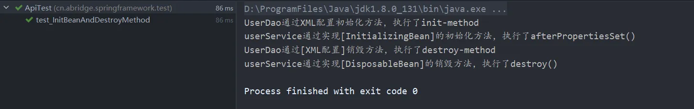
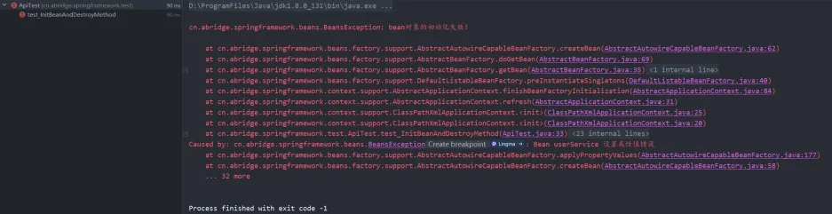
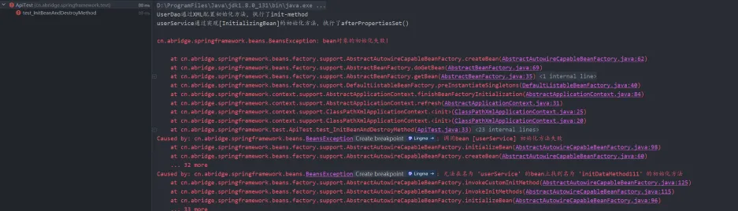

# 第七章、Bean的初始化与销毁扩展方法
## 1 前言
上一篇文章已经对Spring应用上下文有了一定的了解，也通过一些容器扩展机制，来完成对Bean对象的增强。然而，在Spring中，往往我们都需要用到在Bean创建的时候进行初始化以及销毁的时候执行一些我们自己定义的方法。那么这次就接着来实现对bean的自定义初始化与销毁方法。
## 2 思路
在Spring中，定义初始化和销毁方法有三种：

- 1、通过使用`@PostConstruct` 和 `@PreDestroy`注解来实现。（本章节暂不介绍）
- 2、通过实现 `InitializingBean` 和 `DisposableBean` 接口实现。
- 3、使用Spring XML配置`init-method`和`destroy-method`属性来进行定义。

首先是通过实现接口来完成，首先需要定义两个接口`InitializingBean` 和 `DisposableBean`，在具体的bean类去实现这两个接口，并且实现里面的方法。<br />其次是通过XML的配置来实现，需要在XML中定义`init-method`和`destroy-method`属性，在加载bean定义的时候，会在bean定义中设置初始化方法和销毁方法。<br />初始化方法的执行实在初始化bean的时候执行，AbstractAutowireCapableBeanFactory#invokeInitMethods通过此方法来执行。而销毁，无论是实现接口还是XML配置属性，都会在Bean对象初始化完成阶段将销毁注册到DefaultSingletonBeanRegistry#disposableBeans容器中。最后会在DisposableBeanAdapter#destroy方法中去执行销毁。然而在销毁功能，需要向虚拟机中注册一个钩子方法，在虚拟机关闭之前执行关闭容器等操作的方法，即：`Runtime.getRuntime().addShutdownHook(new Thread(this::close));`
## 3 实践
接下来通过代码的解析来学习，本次使用的demo类的结构如下，代码可以看git的v6分支。
```txt
cn.abridge.springframework
├── beans
│   ├── BeansException.java
│   ├── factory
│   │   ├── BeanFactory.java
│   │   ├── config
│   │   │   ├── AutowireCapableBeanFactory.java
│   │   │   ├── BeanDefinition.java
│   │   │   ├── BeanFactoryPostProcessor.java
│   │   │   ├── BeanPostProcessor.java
│   │   │   ├── BeanReference.java
│   │   │   ├── ConfigurableBeanFactory.java
│   │   │   ├── ConfigurableListableBeanFactory.java
│   │   │   └── SingletonBeanRegistry.java
│   │   ├── DisposableBean.java
│   │   ├── HierarchicalBeanFactory.java
│   │   ├── InitializingBean.java
│   │   ├── ListableBeanFactory.java
│   │   ├── support
│   │   │   ├── AbstractAutowireCapableBeanFactory.java
│   │   │   ├── AbstractBeanDefinitionReader.java
│   │   │   ├── AbstractBeanFactory.java
│   │   │   ├── BeanDefinitionReader.java
│   │   │   ├── BeanDefinitionRegistry.java
│   │   │   ├── CglibSubclassingInstantiationStrategy.java
│   │   │   ├── DefaultListableBeanFactory.java
│   │   │   ├── DefaultSingletonBeanRegistry.java
│   │   │   ├── DisposableBeanAdapter.java
│   │   │   ├── InstantiationStrategy.java
│   │   │   └── SimpleInstantiationStrategy.java
│   │   └── xml
│   │       └── XmlBeanDefinitionReader.java
│   ├── PropertyValue.java
│   └── PropertyValues.java
├── context
│   ├── ApplicationContext.java
│   ├── ConfigurableApplicationContext.java
│   └── support
│       ├── AbstractApplicationContext.java
│       ├── AbstractRefreshableApplicationContext.java
│       ├── AbstractXmlApplicationContext.java
│       └── ClassPathXmlApplicationContext.java
├── core
│   ├── io
│   │   ├── AbstractFileResolvingResource.java
│   │   ├── AbstractResource.java
│   │   ├── ClassPathResource.java
│   │   ├── DefaultResourceLoader.java
│   │   ├── FileSystemResource.java
│   │   ├── InputStreamSource.java
│   │   ├── Resource.java
│   │   ├── ResourceLoader.java
│   │   └── UrlResource.java
│   └── NativeDetector.java
└── util
├── Assert.java
├── ClassUtils.java
├── CollectionUtils.java
└── ResourceUtils.java
```
### 3.1 类图


- 通过XML来配置初始化和销毁方法，在XML读取bean信息的时候，会将这两个数据记录到bean定义中。
- 在Bean实例化的时候，执行完前置处理后会执行初始化方法。在实例化结束后，进行注册Bean的销毁方法。会把Bean对应的销毁方法以key-value的方式记录到bean销毁容器中。
- 向JVM运行时注册一个名为SpringContextShutdownHook的关闭钩子，在JVM关闭时关闭此上下文。在Bean销毁时候，会执行销毁方法。

接下来就是对代码的详细解析。
### 3.2 定义XML初始化和销毁属性
首先需要新增定义两个Bean的属性：`initMethodName`与`destroyMethodName`。
```java
public class BeanDefinition {
    private Class beanClass;

    private PropertyValues propertyValues;

    private String initMethodName;

    private String destroyMethodName;
    
    // ...get/set
}
```
这两个属性是为了，在xml去定义bean的时候，可以在里面指定初始化和销毁所要执行的方法，使用方式在xml标签中加上`init-method="初始化方法名" destroy-method="销毁方法名"`这两个属性。然后XML又是如何读取呢？Spring在解析XML的时候，追加在bean定义中设置这两个属性。代码中XmlBeanDefinitionReader#doLoadBeanDefinitions中加上以下代码
```java
public class XmlBeanDefinitionReader extends AbstractBeanDefinitionReader {
    // ...igonre other
    public static final String INIT_METHOD_ATTRIBUTE = "init-method";
    public static final String DESTROY_METHOD_ATTRIBUTE = "destroy-method";
    
    private void doLoadBeanDefinitions(InputStream inputStream) {
        // ...igonre other
        // 1 解析bean标签
        Element bean = (Element) beanNode;
        String initMethodName = bean.getAttribute(INIT_METHOD_ATTRIBUTE);
        String destroyMethodName = bean.getAttribute(DESTROY_METHOD_ATTRIBUTE);
        // 1.3 创建bean定义
        BeanDefinition beanDefinition = new BeanDefinition(clazz);
        // 1.3.1 在bean定义中设置属性：初始化方法和销毁方法
        beanDefinition.setInitMethodName(initMethodName);
        beanDefinition.setDestroyMethodName(destroyMethodName);
    }
    // ...igonre other
}
```
通过Bean的标签去解析对应的属性，即可获得对应初始化和销毁的方法，并且在其存在bean定义中。这个方式到最后是通过反射的形式来执行指定的方法，后续会解释到。
### 3.3 定义初始化和销毁接口
上一种的方式是通过XML配置来指定方法，使用的时候通过反射来执行，然而还有一种是通过定义接口，具体的bean方法去实现这个接口。
```java
// 初始化接口
public interface InitializingBean {

    /**
     * 后置处理方法
     * @throws Exception /
     */
    void afterPropertiesSet() throws Exception;
}
// 销毁接口
public interface DisposableBean {
    /**
     * 销毁方法
     * @throws Exception /
     */
    void destroy() throws Exception;
}
```
### 3.4 执行Bean初始方法
在创建Bean对象时候，会进行创建实例，填充属性，执行BeanPostProcessor的前置和后置处理方法以及初始化方法。在AbstractAutowireCapableBeanFactory#initializeBean方法中，上篇文章我们实现了前后置处理，预留了这段方法，这回就需要真正的来实现执行初始化。
```java
private Object initializeBean(String beanName, Object bean, BeanDefinition mbd) {
    Object wrappedBean = applyBeanPostProcessorsBeforeInitialization(bean, beanName);
    // 在此处执行bean的初始化方法
    try {
        invokeInitMethods(beanName, wrappedBean, mbd);
    } catch (Throwable ex) {
        throw new BeansException("调用bean [" + beanName + "] 初始化方法失败", ex);
    }
    wrappedBean = applyBeanPostProcessorsAfterInitialization(bean, beanName);
    return wrappedBean;
}
```
`invokeInitMethods(beanName, wrappedBean, mbd);`是来执行初始化方法，参照了Spring5.x源码，做了个简化版本。
```java
protected void invokeInitMethods(String beanName, Object bean, BeanDefinition mbd) throws Exception {
    // 这里简化操作，判断是否InitializingBean
    boolean isInitializingBean = (bean instanceof InitializingBean);
    if (isInitializingBean) {
        // 强转并执行
        ((InitializingBean) bean).afterPropertiesSet();
    }
    String initMethodName = mbd.getInitMethodName();
    if (StrUtil.isNotEmpty(initMethodName) &&
            !(isInitializingBean && "afterPropertiesSet".equals(initMethodName))) {
        // 调用自定义初始化方法
        invokeCustomInitMethod(beanName, bean, mbd);
    }
}

private void invokeCustomInitMethod(String beanName, Object bean, BeanDefinition mbd) throws Exception {
    // 通过反射完成
    String initMethodName = mbd.getInitMethodName();
    Assert.state(initMethodName != null, "没有定义的初始化方法");
    Method initMethod = ClassUtil.getPublicMethod(mbd.getBeanClass(), initMethodName);
    if (initMethod == null) {
        throw new BeansException("无法在名为 '" + beanName + "' 的bean上找到名为 '" + initMethodName + "' 的初始化方法");
    }
    initMethod.invoke(bean);
}
```
这里有两个方式，一是直接调用实现初始化接口的方法，二是通过XML配置的初始化方法，通过反射来完成调用。但是其实这里是一并执行的，首先会判断是否实现了`InitializingBean`，通过执行`afterPropertiesSet()`方法，直接执行初始化，接着会获取bean定义的`initMethodName`，这个方法是XML配置的属性，在解析XML的时候将其存在Bean定义中，XML定义的初始化方法通过反射来完成。
> 这里如果一个对象既实现了InitializingBean接口，又自定义了一个初始化方法，但是两个方法名不一致，在初始化的时候就会按顺序执行，先是执行了实现InitializingBean接口的方法，再去执行XML配置的方法。但如果XML配置的也是叫afterPropertiesSet，那就只会执行一次。

### 3.5 定义销毁方法与执行
销毁方法相比初始化是比较复杂的，它是在bean生命周期要结束之前执行的方法。简单理解就是首先需要将对应的方法存到bean的销毁容器中，等生命周期结束时会将容器中的方法移除并执行对应的销毁方法。
#### 3.5.1 定义Bean销毁方法的容器
在DefaultSingletonBeanRegistry中需要定义个容器来存放bean对应得销毁方法。
```java
public class DefaultSingletonBeanRegistry implements SingletonBeanRegistry {
    // ...ignore other
    private final Map<String, DisposableBean> disposableBeans = new LinkedHashMap<>();
    
    public void registerDisposableBean(String beanName, DisposableBean bean) {
        disposableBeans.put(beanName, bean);
    }

    public void destroySingletons() {
        ArrayList<String> beanNames = new ArrayList<>(disposableBeans.keySet());
        for (String beanName : beanNames) {
            DisposableBean disposableBean = disposableBeans.remove(beanName);
            try {
                disposableBean.destroy();
            } catch (Exception e) {
                throw new BeansException("bean名称 '" + beanName + "' 在执行销毁方法时，抛出了异常", e);
            }
        }
    }
}
```
在创建Bean的时候会进行注册含有销毁方法的bean，会调用registerDisposableBean方法。而registerDisposableBean是定义执行销毁的方法，最终执行还是通过执行适配器的destroy()方法。
#### 3.5.2 注册有销毁方法的Bean
在Bean的生命周期中，当创建Bean执行结束初始化后，会进行注册定义的bean的销毁方法。<br />首先需要一个适配器，DisposableBeanAdapter 是一个用于管理和执行 Spring 容器中 Bean 销毁逻辑的适配器类。它的主要功能是确保在 Spring 容器关闭时，合适地调用 Bean 的销毁方法，以释放资源或执行清理工作。DisposableBeanAdapter 在处理 Bean 的生命周期管理时扮演了重要角色。

> DisposableBeanAdapter 也是 Spring 容器管理 Bean 生命周期的一部分。它确保了 Bean 在不再使用时能够被正确地销毁，避免内存泄漏或者资源浪费。

```java
public class DisposableBeanAdapter implements DisposableBean {

    private static final String DESTROY_METHOD_NAME = "destroy";

    private static final String CLOSE_METHOD_NAME = "close";

    private static final String SHUTDOWN_METHOD_NAME = "shutdown";

    private final Object bean;

    private final String beanName;

    private final String destroyMethodName;

    public DisposableBeanAdapter(Object bean, String beanName, BeanDefinition beanDefinition) {
        this.bean = bean;
        this.beanName = beanName;
        this.destroyMethodName = beanDefinition.getDestroyMethodName();
    }

    @Override
    public void destroy() throws Exception {
        if (bean instanceof DisposableBean) {
            ((DisposableBean) bean).destroy();
        }
        // 避免同时继承自DisposableBean，且自定义方法与DisposableBean方法同名，销毁方法执行两次的情况
        if (ObjectUtil.isNotEmpty(destroyMethodName) && !(bean instanceof DisposableBean && DESTROY_METHOD_NAME.equals(this.destroyMethodName))) {
            // 通过反射执行方法
            Method destroyMethod = ClassUtil.getPublicMethod(bean.getClass(), destroyMethodName);
            if (destroyMethod == null) {
                throw new BeansException("无法找到销毁方法名为 '" + destroyMethodName + "' 从bean为 '" + beanName + "'");
            }
            destroyMethod.invoke(bean);
        }
    }
}
```

- 构造方法传入了bean的信息，以及BeanDefinition，这就使得这个对象中能够含有Bean的一些参数信息。
- destroy() 方法是 DisposableBeanAdapter 的核心，负责按照顺序调用 Bean 的销毁逻辑。它会依次检查是否实现了 DisposableBean 接口、是否配置了自定义销毁方法，并依次调用这些方法。
- 在destroy()方法中，首先会进行校验，判断是否实现了DisposableBean接口，是的话直接执行定义的销毁方法（此方法就是具体的Bean对象实现的销毁方法）。其次，会过滤相同销毁方法名，免得在XML配置了与实现DisposableBean的方法名字相同而执行了两次，于是通过反射执行自定义的销毁方法。

接着就是注册销毁方法
```java
private void registerDisposableBeanIfNecessary(String beanName, Object bean, BeanDefinition mbd) {
    if (bean instanceof DisposableBean || StrUtil.isNotEmpty(mbd.getDestroyMethodName())) {
        registerDisposableBean(beanName, new DisposableBeanAdapter(bean, beanName, mbd));
    }
}
```
因为AbstractAutowireCapableBeanFactory类最终还是继承了DefaultSingletonBeanRegistry类，所以这里会直接调用DefaultSingletonBeanRegistry#registerDisposableBean方法，将自定义的销毁方法存到Bean销毁方法容器中。
#### 3.5.3 定义虚拟机关闭钩子与执行销毁
接下来，我们需要定义`registerShutdownHook()`来注册JVM钩子的方法。
> 在 Spring 框架中，`registerShutdownHook()` 是用于注册一个 JVM 钩子（Shutdown Hook）的方法，确保 Spring 应用在 JVM 关闭时能够执行必要的清理工作。这个方法通常在 Spring 应用程序上下文（`ApplicationContext`）中被调用，目的是确保在应用程序正常退出或异常终止时能够正确关闭 Spring 容器并释放资源。  

首先需要在ConfigurableApplicationContext接口中定义close()与registerShutdownHook()方法。最终由于AbstractApplicationContext类去实现。
```java
public interface ConfigurableApplicationContext extends ApplicationContext {
    /**
     * 关闭应用上下文
     */
    void close();

    /**
     * 向虚拟机中注册一个钩子方法，在虚拟机关闭之前执行关闭容器等操作
     * <p>实际上是将正真销毁的方法在 {@code doClose} 方法中</p>
     */
    void registerShutdownHook();
    // ...ignore other
}
```
在AbstractApplicationContext实现注册钩子与执行销毁
```java
public abstract class AbstractApplicationContext extends DefaultResourceLoader
        implements ConfigurableApplicationContext {
    // ... ignore other
    @Override
    public void close() {
        doClose();
    }

    @Override
    public void registerShutdownHook() {
        Runtime.getRuntime().addShutdownHook(new Thread(this::close));
    }

    protected void doClose() {
        destroyBeans();
    }

    protected void destroyBeans() {
        getBeanFactory().destroySingletons();
    }
}
```
当 JVM 进程即将关闭时，Spring 会通过这个钩子自动调用 ApplicationContext 的 close() 方法，触发 Spring 容器的关闭流程。这包括销毁所有单例作用域的 Bean，并调用这些 Bean 的销毁回调方法（例如实现了 DisposableBean 接口的 Bean，或者通过 @PreDestroy 标注的方法）。最终是由destroyBeans()去执行了销毁。<br />其工作原理就是registerShutdownHook() 在内部使用了`Runtime.getRuntime().addShutdownHook(Thread hook)`，它向 JVM 注册了一个关闭钩子。这个钩子是一个线程，当 JVM 关闭时，JVM 会调用这个线程的 run() 方法。Spring 注册的钩子会在 JVM 关闭时调用`ApplicationContext.close()`，从而触发 Spring 容器的关闭过程。
## 4 测试
接下来，我们用上篇文章进行加以修改进行测试。
### 4.1 XML配置定义Bean
我们还是定义了两个Bean，一个是UserDao，另一个是UserService。首先我们先看XML配置内容。
```xml
<?xml version="1.0" encoding="UTF-8"?>
<beans>
  <bean id="userDao" class="cn.abridge.springframework.test.bean.UserDao" init-method="initDataMethod" destroy-method="destroyDataMethod"/>

  <bean id="userService" class="cn.abridge.springframework.test.bean.UserService" init-method="initDataMethod" destroy-method="destroyDataMethod">
    <property name="id" value="1"/>
    <property name="userDao" ref="userDao"/>
    <property name="address" value="浙江杭州"/>
    <property name="tel" value="86-0571"/>
  </bean>
</beans>
```
从这个XML配置文件中，两个Bean都定义了initDataMethod与destroyDataMethod，分别为初始化的方法与销毁方法，在XML解析的时候，这两个方法名会被存在bean定义中，最后注册到容器中。
### 4.2 Bean初始化与销毁方法的定义
对于UserService这个Bean，会去实现InitializingBean, DisposableBean这两个接口，这样就需要实现对应的afterPropertiesSet()与destroy()两个方法。<br />UserDao，只是定义了初始化与销毁方法
```xml
public class UserDao {
    private static Map<String, String> hashMap = new HashMap<>();

    public void initDataMethod() {
        System.out.println("UserDao通过XML配置初始化方法，执行了init-method");
        hashMap.put("1", "怒放吧德德");
        hashMap.put("2", "愤怒吧德德");
        hashMap.put("3", "爱国德德");
    }

    public String queryUserId(String id) {
        return hashMap.get(id);
    }

    public void destroyDataMethod(){
        System.out.println("UserDao通过[XML配置]销毁方法，执行了destroy-method");
        hashMap.clear();
    }
}
```
UserService，定义了初始化与销毁方法以及实现了InitializingBean, DisposableBean接口
```xml
public class UserService implements InitializingBean, DisposableBean {
    private String id;

    private String address;

    private String tel;

    private UserDao userDao;

    // get/set

    @Override
    public void destroy() throws Exception {
        System.out.println("userService通过实现[DisposableBean]的销毁方法，执行了destroy()");
    }

    @Override
    public void afterPropertiesSet() throws Exception {
        System.out.println("userService通过实现[InitializingBean]的初始化方法，执行了afterPropertiesSet()");
    }

    public void initDataMethod() {
        System.out.println("userService另一个初始化方法");
    }
    public void destroyDataMethod(){
        System.out.println("userService另一个销毁方法");
    }
}

```
接下来，我们看一下测试类
```xml
public class ApiTest {
    @Test
    public void test_InitBeanAndDestroyMethod() throws IOException {
        ClassPathXmlApplicationContext applicationContext = new ClassPathXmlApplicationContext("classpath:spring.xml");
        applicationContext.registerShutdownHook();
    }
}
```
当我们运行之后，我们可以看到，UserService初始化会执行两个，销毁也会执行两个，也就是XML指定的方法，以及实现接口的方法都被执行了。<br />

<br />并且我们可以看到执行的先后顺序，但是如果我们把初始化和销毁方法都指定了相同的方法，那会怎样呢？
```xml
<?xml version="1.0" encoding="UTF-8"?>
<beans>
    <bean id="userDao" class="cn.abridge.springframework.test.bean.UserDao" init-method="initDataMethod" destroy-method="destroyDataMethod"/>

    <bean id="userService" class="cn.abridge.springframework.test.bean.UserService" init-method="afterPropertiesSet" destroy-method="destroy">
        <property name="id" value="1"/>
        <property name="userDao" ref="userDao"/>
        <property name="address" value="浙江杭州"/>
        <property name="tel" value="86-0571"/>
    </bean>
</beans>
```
我们把userService的init-method与destroy-method换成了与实现接口的方法名相同。<br />

<br />实际上就只会执行一次，因为在上文的代码解析中也提到了，会过滤相同的方法名。<br />如果我们随便将userDao的init-method指定的方法改成一个不存在的方法，那会是怎样呢？<br />

<br />结果是在给bean填充属性的时候就会报错。<br />如果userDao正常，userService的init-method指定的方法改成一个不存在的方法，那会是怎样呢？<br />

<br />在执行初始化方法的时候，实现接口的方法顺利执行，但是通过反射执行指定的方法时候会报错。
## 5 总结
本章学习了如果通过实现InitializingBean, DisposableBean这两个接口以及通过XML配置init-method与destroy-method来执行初始化和销毁方法。进一步更加完善了Spring中Bean的生命周期，从创建到初始化再到消亡。也了解了registerShutdownHook() 是 Spring 提供的一个方便方法，能够用来确保 Spring 容器在 JVM 关闭时能够自动执行清理工作。
