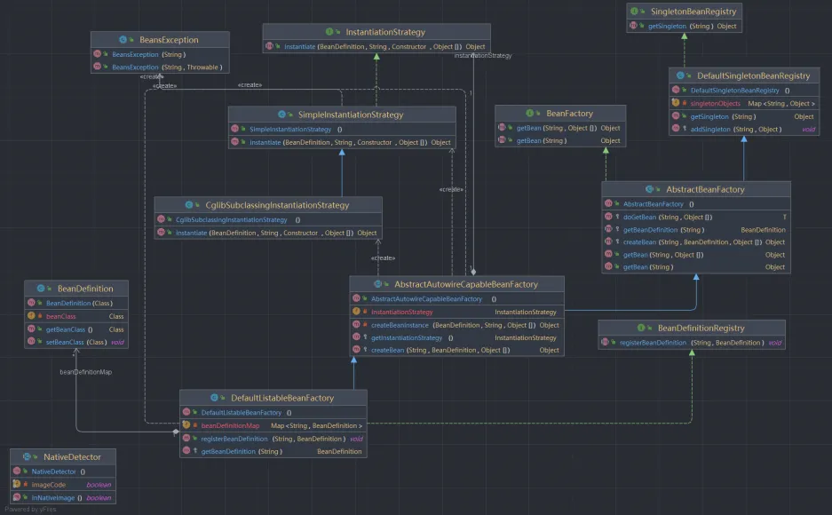
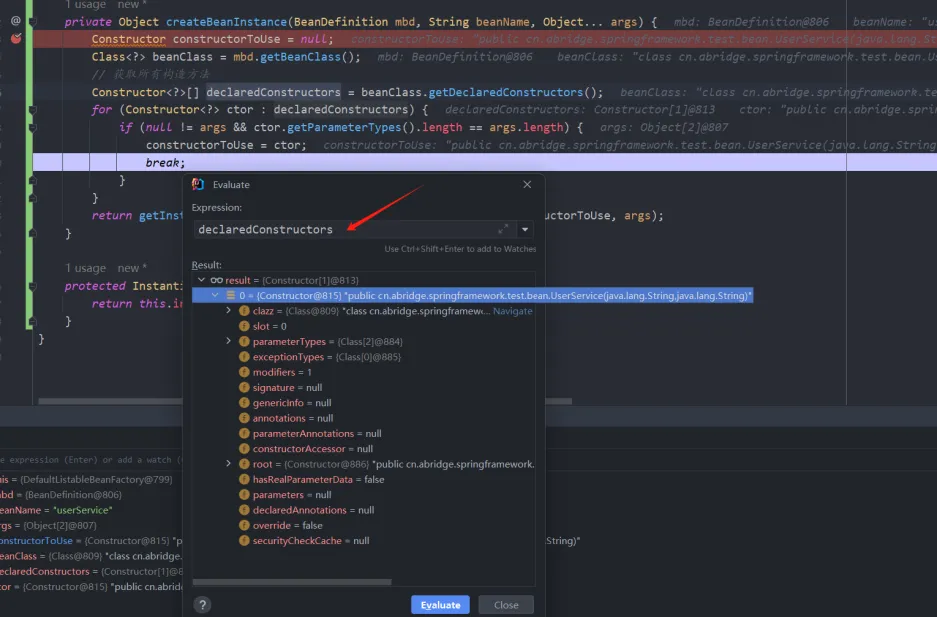
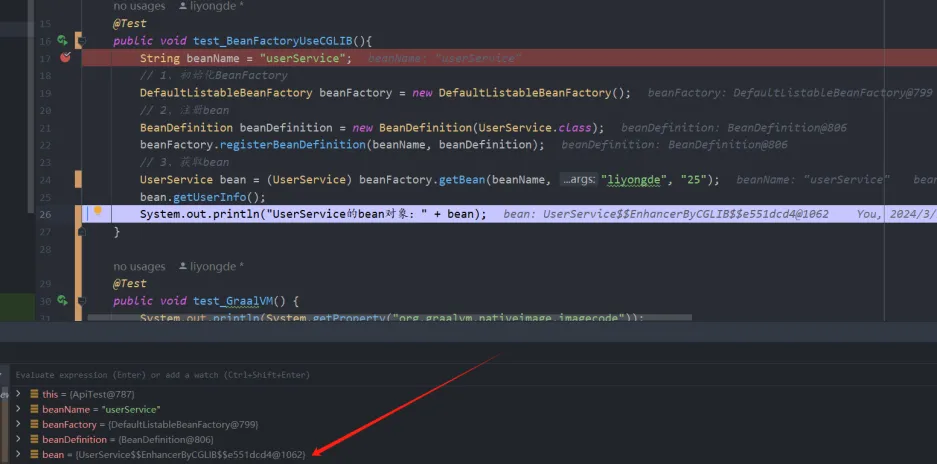

# 第三章、基于Cglib进一步实现含参构造实例化
## 一、前言
经过上一篇的学习，已经能够实现对bean的创建和获取，但是实例化的是无参的对象，这次就来更进一步实现Spring框架的创建实例。本次是采用了策略模式进一步对Bean对象基于JDK和CGLIB进行实例化。
## 二、思路
这次的学习是基于上一次的代码进行延申，上一次代码在[v2分支](https://github.com/lydAndtry/abridge-spring/tree/v2)。上篇文章实现的是无参的实例化构造，这次来实现含参的构造函数实例化对象。改动了抽象Bean工厂的getBean()方法，将实例化的方式提取出来，使用策略模式，用jdk和cglib两种方式来实现Bean对象的实例化，这样就跟Spring框架更近一步。
### 1、前置知识
随着深入学习，所用的demo也会随之加深。如果是大佬那就无所谓，如果是小白的话，建议需要了解java基础知识，因为这些类都是各种抽象类的继承与接口类实现。
#### 1.1 Constructor
`Constructor` 类是Java反射包 `java.lang.reflect` 中的一个关键类。使用 Constructor 类的对象，我们可以获取类的构造方法信息，并可以创建该类的新实例。
#### 1.2 Constructor#getParameterTypes()
这个方法在调用时，会返回一个数组，数组中的元素是表示构造方法参数类型的 Class 对象。数组中的元素的顺序与构造方法的参数列表中的参数顺序一致。
#### 1.3 Class#getDeclaredConstructors()
这个方法用于获取 Class 对象所表示的类或接口的所有声明的构造方法，包括 public，protected，default (package)，以及 private 的构造方法。其返回一个 Constructor<?>[] 数组，这个数组包含了 Class 对象所表示的这个类中的所有构造方法的 Constructor 对象。
#### 1.4 Class#getDeclaredConstructor(Class<?>... parameterTypes)
这个方法用于获取当前 Class 对象表示的类或接口的指定参数类型的构造方法。一个类可能有多个构造函数，这些构造函数的参数列表可能不同。我们可以通过传入构造函数的参数类型，来获取类的特定构造函数。
#### 1.5 Cglib
cglib 是能够动态生成Bean对象，是为那些没有实现接口的类实现代理的，利用asm开源包，对代理对象类的字节码进行操作，生成代理类，加载并返回。
## 三、实践
本次使用的demo类的结构如下，代码可以看git的v3分支
```stex
java
└─cn.abridge.springframework
  ├─ beans
  │  ├─ BeansException.java
  │  │  
  │  └─ factory
  │      ├─ BeanFactory.java
  │      │  
  │      ├─ config
  │      │    ├─ BeanDefinition.java
  │      │    └─ SingletonBeanRegistry.java
  │      │      
  │      └─support
  │           ├─ AbstractAutowireCapableBeanFactory.java
  │           ├─AbstractBeanFactory.java
  │           ├─BeanDefinitionRegistry.java
  │           ├─CglibSubclassingInstantiationStrategy.java
  │           ├─DefaultListableBeanFactory.java
  │           ├─DefaultSingletonBeanRegistry.java
  │           ├─ InstantiationStrategy.java
  │           └─ SimpleInstantiationStrategy.java
  │              
  └─core
     └─NativeDetector.java
```
### 1、类图
如图所示，本次实现的案例的类图<br />

<br />这张类图看起来好像很复杂，实则不简单。整体结构与v2分支的差不多，主要是多了使用了[策略模式](https://blog.csdn.net/qq_43843951/article/details/126843838)来进行实例化对象，多出了实例化对象的接口以及基于jdk和基于cglib两种方式来实例化bean对象的策略（主要是由抽象策略角色，这是一个接口，通常由一个接口或抽象类实现，此角色会定义所有的具体策略类所需的接口。可以是有多个策略角色来实现策略方法）。<br />这里就来简单的介绍本次案例改动的地方：

- 在BeanFactory下新增了一个接口getBean(String name, Object... args)，来让子类也实现能够实例化携带参数的bean对象。
- 在抽象的Bean工厂AbstractBeanFactory类中，改造了无参和含参的getBean()方法，并且将公共方法提取到doGetBean(...)方法中，案例更进一步像Spring框架源码。
- InstantiationStrategy，这个接口是策略接口，提供一个实例化的方法，让具体的策略实现。
- SimpleInstantiationStrategy，具体的策略角色，用jdk的方式实例化对象。
- CglibSubclassingInstantiationStrategy，具体的策略角色，用cglib的方式实例化对象。
### 2、实例化策略接口
`InstantiationStrategy`用来定义实例化策略的接口类，提供instantiate(...)实例化方法，由具体的子类来实现实例化方式。
```java
package cn.abridge.springframework.beans.factory.support;

import cn.abridge.springframework.beans.BeansException;
import cn.abridge.springframework.beans.factory.config.BeanDefinition;
import com.sun.istack.internal.Nullable;

import java.lang.reflect.Constructor;

/**
 * @Author: lyd
 * @Date: 2024/3/25 21:04
 * @Description: 负责创建与根bean定义相对应实例的接口
 * <p>由于有各种可能的方法，包括使用CGLIB动态地创建子类以支持方法注入，因此可以将此提取到策略中。</p>
 */
public interface InstantiationStrategy {

    /**
     *返回具有给定名称的bean实例，并通过给定构造函数创建它。
     * @param bd bean定义
     * @param beanName bean名称
     * @param ctor 构造函数
     * @param args 构造函数参数
     * @return bean对象
     * @throws BeansException 如果实例化失败，抛出异常
     */
    Object instantiate(BeanDefinition bd, @Nullable String beanName, Constructor ctor,
                       Object... args) throws BeansException;
}
```
> 由不同的子类去实现，我们可以到Spring的源码中查看，其提供了三个实例化的方法，这里我们通过传递Bean定义、Bean名称、Constructor类(这个在前置知识有提及)、所需要的参数（args，这里也是采用了可变参数`...`）

### 3、JDK实例化策略
`SimpleInstantiationStrategy`这个类是具体的策略角色，主要是通过JDK的方式来完成对Bean对象的实例化，具体代码如下：
```java
package cn.abridge.springframework.beans.factory.support;

import cn.abridge.springframework.beans.BeansException;
import cn.abridge.springframework.beans.factory.config.BeanDefinition;

import java.lang.reflect.Constructor;
import java.lang.reflect.InvocationTargetException;

/**
 * @Author: lyd
 * @Date: 2024/3/25 21:15
 * @Description: 简单实例化策略CglibSubclassingInstantiationStrategy
 * <p>用来实例化bean对象</p>
 */
public class SimpleInstantiationStrategy implements InstantiationStrategy {
    @Override
    public Object instantiate(BeanDefinition bd, String beanName, Constructor ctor, Object... args) throws BeansException {
        Class clazz = bd.getBeanClass();
        try {
            if (null != ctor) {
                // 根据参数类型来获取类的构造函数，并实例化
                return clazz.getDeclaredConstructor(ctor.getParameterTypes()).newInstance(args);
            } else {
                // 实例化无参对象
                return clazz.newInstance();
            }
        } catch (NoSuchMethodException | InstantiationException | IllegalAccessException | InvocationTargetException e) {
            throw new BeansException("实例化 [" + clazz.getName() + "] 失败！", e);
        }
    }
}
```
`SimpleInstantiationStrategy`类实现了`InstantiationStrategy`接口类，并实现了`instantiate(...)`方法。<br />思路也很简单，根据bean定义获取bean类，判断Constructor类是否为空，为空则实例化无参对象，反之通过构造器的参数类型匹配对应的构造参数，通过newInstance(args)传入参数进行实例化。
### 4、Cglib实例化策略
`CglibSubclassingInstantiationStrategy`这是Cglib子类实例化策略，通过动态实例化对象。<br />这里首先需要引入CGLIB依赖坐标。
```xml
<!-- https://mvnrepository.com/artifact/cglib/cglib -->
<dependency>
  <groupId>cglib</groupId>
  <artifactId>cglib</artifactId>
  <version>3.3.0</version>
</dependency>
```
:::info
cglib 提供了一个简单的 API 来处理复杂的运行时代码生成和类加载。在 Java 中，cglib 能够通过超类的方式生成动态代理。<br />使用 cglib，你可以在运行时动态的生成一个类的子类，然后覆盖其中的一些方法，添加一些行为，比如监视方法的调用、动态添加业务逻辑等等。
:::
```java
package cn.abridge.springframework.beans.factory.support;

import cn.abridge.springframework.beans.BeansException;
import cn.abridge.springframework.beans.factory.config.BeanDefinition;
import net.sf.cglib.proxy.Enhancer;
import net.sf.cglib.proxy.NoOp;

import java.lang.reflect.Constructor;

/**
 * @Author: lyd
 * @Date: 2024/3/25 21:28
 * @Description: Cglib子类实例化策略
 * <p>生成CGLIB对象</p>
 */
public class CglibSubclassingInstantiationStrategy extends SimpleInstantiationStrategy {

    @Override
    public Object instantiate(BeanDefinition bd, String beanName, Constructor ctor, Object... args) throws BeansException {
        // CGLIB的增强类对象
        Enhancer enhancer = new Enhancer();
        enhancer.setSuperclass(bd.getBeanClass());
        enhancer.setCallback(new NoOp() {
            @Override
            public int hashCode() {
                return super.hashCode();
            }
        });
        if (null == ctor) {
            // 返回的是无参
            return enhancer.create();
        }
        return enhancer.create(ctor.getParameterTypes(), args);
    }
}
```
这里会用到cglib的增强类`Enhancer`，在Spring框架中，这个是自己实现的类，在org.springframework.cglib包中，Spring实现了许多的cglib的功能。然而这里我们使用开源项目也能够达到相应的效果。
> 在Spring框架中，这里是直接在实例上设置回调，而不是在增强类中(通过Enhancer)设置回调，以避免内存泄漏。

这里我们也是通过cglib来为提供的bean定义创建bean类的增强子类。在Spring中也是如此，如下代码是Spring源码中的一段代码，我们通过简单例子实现就行，不考虑其他问题。
```java
public Object instantiate(@Nullable Constructor<?> ctor, Object... args) {
    // 使用CGLIB为提供的bean定义创建bean类的增强子类。
    Class<?> subclass = createEnhancedSubclass(this.beanDefinition);
    Object instance;
    if (ctor == null) {
        instance = BeanUtils.instantiateClass(subclass);
    }
    else {
        try {
            Constructor<?> enhancedSubclassConstructor = subclass.getConstructor(ctor.getParameterTypes());
            instance = enhancedSubclassConstructor.newInstance(args);
        }
        catch (Exception ex) {
            throw new BeanInstantiationException(this.beanDefinition.getBeanClass(),
                    "Failed to invoke constructor for CGLIB enhanced subclass [" + subclass.getName() + "]", ex);
        }
    }
    // 设置了一些CGLIB回调以进行方法拦截。这允许实现诸如查找方法注入和方法替换等功能。
    // SPR-10785: 直接在实例上设置回调，而不是在增强类中(通过Enhancer)设置回调，以避免内存泄漏。
    Factory factory = (Factory) instance;
    factory.setCallbacks(new Callback[] {NoOp.INSTANCE,
            new LookupOverrideMethodInterceptor(this.beanDefinition, this.owner),
            new ReplaceOverrideMethodInterceptor(this.beanDefinition, this.owner)});
    return instance;
}
/**
 * 使用CGLIB为提供的bean定义创建bean类的增强子类。
 */
private Class<?> createEnhancedSubclass(RootBeanDefinition beanDefinition) {
    Enhancer enhancer = new Enhancer();
    enhancer.setSuperclass(beanDefinition.getBeanClass());
    enhancer.setNamingPolicy(SpringNamingPolicy.INSTANCE);
    if (this.owner instanceof ConfigurableBeanFactory) {
        ClassLoader cl = ((ConfigurableBeanFactory) this.owner).getBeanClassLoader();
        enhancer.setStrategy(new ClassLoaderAwareGeneratorStrategy(cl));
    }
    enhancer.setCallbackFilter(new MethodOverrideCallbackFilter(beanDefinition));
    enhancer.setCallbackTypes(CALLBACK_TYPES);
    return enhancer.createClass();
}
```
### 5、Bean工厂含参接口与实现
#### 5.1 BeanFactory接口
在Bean接口类多加一个含参的方法。
```java
package cn.abridge.springframework.beans.factory;

import cn.abridge.springframework.beans.BeansException;

/**
 * @Author: lyd
 * @Date: 2024/3/19 20:45
 * @Description: bean工厂
 */
public interface BeanFactory {

    /**
     * 获取bean
     * @param name bean名
     * @return bean对象
     * @throws BeansException 如果拿不到bean
     */
    Object getBean(String name) throws BeansException;

    /**
     * 返回指定bean的一个实例，它可以是共享的，也可以是独立的
     * @param name bean的名称
     * @param args 使用显式参数创建bean实例时使用的参数
     * @return bean的实例
     * @throws BeansException 如果创建失败抛出的异常
     */
    Object getBean(String name, Object... args) throws BeansException;
}

```
#### 5.2 抽象Bean工厂改造
```java
package cn.abridge.springframework.beans.factory.support;

import cn.abridge.springframework.beans.BeansException;
import cn.abridge.springframework.beans.factory.BeanFactory;
import cn.abridge.springframework.beans.factory.config.BeanDefinition;

/**
 * @Author: lyd
 * @Date: 2024/3/20 21:33
 * @Description: 抽象类定义模板方法
 */
public abstract class AbstractBeanFactory extends DefaultSingletonBeanRegistry implements BeanFactory {

    @Override
    public Object getBean(String name) throws BeansException {
        return doGetBean(name, (Object) null);
    }

    /**
     * 实现BeanFactory获取bean对象
     * @param name bean名
     * @return bean对象
     */
    @Override
    public Object getBean(String name, Object... args) {
        return doGetBean(name, args);
    }

    /**
     * 抽取方法，获取Bean对象
     * @param name bena名称
     * @param args 参数
     * @return bean实例
     * @param <T> 泛型
     */
    protected <T> T doGetBean(String name, Object... args) {
        // 获取单例bean对象
        Object bean = getSingleton(name);
        if (bean != null) {
            return (T) bean;
        }
        // 创建bean定义
        BeanDefinition beanDefinition = getBeanDefinition(name);
        // 调用创建bean对象
        return (T) createBean(name, beanDefinition, args);
    }
    /**
     * 返回给定bean名称的bean定义
     * <p>
     *     这里是根据Spring源码中保持一样，在源码中是个抽象方法，由具体的DefaultListableBeanFactory类进行实现
     * </p>
     * @param beanName bean名称
     * @return bean定义
     * @throws BeansException 抛出的bean异常
     */
    protected abstract BeanDefinition getBeanDefinition(String beanName) throws BeansException;

    /**
     * 获取bean对象
     * @param beanName bean名称
     * @param mbd bean定义
     * @return bean对象
     * @throws BeansException 抛出的bean异常
     */
    protected abstract Object createBean(String beanName, BeanDefinition mbd, Object... args) throws BeansException;
}
```
在doGetBean()方法中，我们简单实现，这里需要实现带参数的createBean方法。
### 6、策略模式实例化
在AbstractAutowireCapableBeanFactory抽象类中，完成了创建含参数实例化bean类，采用了策略模式。
#### 6.1 选择策略对象
这里为了模仿Spring源码，我创建了**用于检测GraalVM本机映像环境的通用委托**的`NativeDetector`抽象类，这里就需要简单了解一下GraalVM。
> GraalVM 是一个高性能的运行时环境，它提供了一个先进的Java虚拟机（JVM），能够支持多种语言（如Java, JavaScript, Ruby, R, Python等等）的编译和运行。GraalVM 还提供了一个原生镜像生成工具，可以将Java程序编译成一个独立的、不依赖JVM的可执行文件。 - GPT

大概说的就是他是个运行Java的虚拟机，接下来看一下代码。
```java
package cn.abridge.springframework.core;

/**
 * @Author: lyd
 * @Date: 2024/3/26 20:31
 * @Description: 用于检测GraalVM本机映像环境的通用委托。
 */
public abstract class NativeDetector {

    /** See <a href="https://github.com/oracle/graal/blob/master/sdk/src/org.graalvm.nativeimage/src/org/graalvm/nativeimage/ImageInfo.java">
     * github-graalvm
     * </a> */
    private static final boolean imageCode = (System.getProperty("org.graalvm.nativeimage.imagecode") != null);

    /**
     * 如果在映像构建上下文中或在映像运行时期间调用，返回 {@code true} ,反之返回 {@code false} 。
     */
    public static boolean inNativeImage() {
        return imageCode;
    }
}
```
这段代码是用来检测当前的运行环境是否设置了`org.graalvm.nativeimage.imagecode`这个系统属性，返回一个boolean值。
:::info
至于 "org.graalvm.nativeimage.imagecode" 这个系统属性，在应用运行在GraalVM的原生镜像环境（native-image）时，会被GraalVM自动设置。也就是说，该属性是由GraalVM 内部自动设置并维护的，在应用代码中并不能手动配置该属性。
:::
在AbstractAutowireCapableBeanFactory类中，会通过构造函数来完成对bean实例化的策略对象的创建。（后面为了测试这里就直接固定通过jdk或者cglib来实现，毕竟我哪来的GraalVM环境。）
```java
/** 创建bean实例的策略。 */
private InstantiationStrategy instantiationStrategy;

/**
 * 构造函数
 * 模仿spring源码使用构造器初始化创建bean实例的策略
 */
public AbstractAutowireCapableBeanFactory() {
    if (NativeDetector.inNativeImage()) {
        this.instantiationStrategy = new SimpleInstantiationStrategy();
    } else {
        this.instantiationStrategy = new CglibSubclassingInstantiationStrategy();
    }
}
```
#### 6.2 完整代码
其主要也就是通过不同的策略角色执行对应类的实例化方法，返回bean对象。再将bean存到单例Bean对象池中。
```java
package cn.abridge.springframework.beans.factory.support;

import cn.abridge.springframework.beans.BeansException;
import cn.abridge.springframework.beans.factory.config.BeanDefinition;
import cn.abridge.springframework.core.NativeDetector;

import java.lang.reflect.Constructor;

/**
 * @Author: lyd
 * @Date: 2024/3/20 22:10
 * @Description: 实例化Bean类 自动装配能力Bean工厂, 在spring源码中还会去实现AutowireCapableBeanFactory，这里就简单操作
 */
public abstract class AbstractAutowireCapableBeanFactory extends AbstractBeanFactory {

    /** 创建bean实例的策略。 */
    private InstantiationStrategy instantiationStrategy;

    /**
     * 构造函数
     * 模仿spring源码使用构造器初始化创建bean实例的策略
     */
    public AbstractAutowireCapableBeanFactory() {
        if (NativeDetector.inNativeImage()) {
            this.instantiationStrategy = new SimpleInstantiationStrategy();
        } else {
            this.instantiationStrategy = new CglibSubclassingInstantiationStrategy();
        }
    }

    /**
     * 创建bean对象（生产bean实例）
     * @param beanName bean名称
     * @param mbd bean定义
     * @return bean实例
     * @throws BeansException bean异常
     */
    @Override
    protected Object createBean(String beanName, BeanDefinition mbd, Object... args) throws BeansException {
        Object bean;
        try {
            // 创建bean实例 将其抽取出去
            bean = createBeanInstance(mbd, beanName, args);
        } catch (Exception e) {
            throw new BeansException("bean对象的初始化失败!");
        }
        // 添加单例bean
        addSingleton(beanName, bean);
        return bean;
    }

    private Object createBeanInstance(BeanDefinition mbd, String beanName, Object... args) {
        Constructor constructorToUse = null;
        Class<?> beanClass = mbd.getBeanClass();
        // 获取所有构造方法
        Constructor<?>[] declaredConstructors = beanClass.getDeclaredConstructors();
        for (Constructor<?> ctor : declaredConstructors) {
            if (null != args && ctor.getParameterTypes().length == args.length) {
                constructorToUse = ctor;
                break;
            }
        }
        return getInstantiationStrategy().instantiate(mbd, beanName, constructorToUse, args);
    }

    protected InstantiationStrategy getInstantiationStrategy() {
        return this.instantiationStrategy;
    }
}
```
首先是定义个`InstantiationStrategy`创建对象的实例化策略属性类，这个策略接口由子类`SimpleInstantiationStrategy`和`CglibSubclassingInstantiationStrategy`类去实现instantiate()方法，在这个抽象类中，通过构造函数去初始化策略角色。<br />接着在执行创建bean实例化时，通过Class#getDeclaredConstructors()获取所有的构造方法，找出参数个数和我们提供的参数个数匹配的构造方法。<br />最后执行策略角色实现的实例化方法。
## 四、测试
这次测试，我们提供了一个带有两个参数的UserService类，接下来看一下测试样例。
```java
@Test
public void test_BeanFactoryUseCGLIB(){
    String beanName = "userService";
    // 1、初始化BeanFactory
    DefaultListableBeanFactory beanFactory = new DefaultListableBeanFactory();
    // 2、注册bean
    BeanDefinition beanDefinition = new BeanDefinition(UserService.class);
    beanFactory.registerBeanDefinition(beanName, beanDefinition);
    // 3、获取bean
    UserService bean = (UserService) beanFactory.getBean(beanName, "liyongde", "25");
    bean.getUserInfo();
    System.out.println("UserService的bean对象：" + bean);
}
```
首先，我们使用的是Cglib的方式来实现，然后进行debug来跟进。<br />

<br />可以看到创建实例化的时候通过获取类的构造函数信息来匹配获取信息。<br />

<br />这里可以看到通过了Cglib的方式动态实例化了对象。实例化的对象会显示`$$EnhancerByCGLIB$$e551dcd4`。<br />输出结果，这样携带参数的方式就创建成功。
```java
获取用户信息!!!liyongde 25
UserService的bean对象：cn.abridge.springframework.test.bean.UserService$$EnhancerByCGLIB$$e551dcd4@43738a82
```
我们在看看通过JDK的方式创建对象情况
```java
获取用户信息!!!liyongde 25
UserService的bean对象：cn.abridge.springframework.test.bean.UserService@506c589e
```
## 五、总结
本章节更进一步对实例化的创建，通过策略方式将实例化抽出来InstantiationStrategy#instantiate(...)，在通过不同方式的子类去实现对Bean对象的实例化。学习的时候，建议对照着Spring源码进行查看，认知，不了解的可以借助GPT来学习，实在看不下去就跳过，最重要的是需要动手操作。
