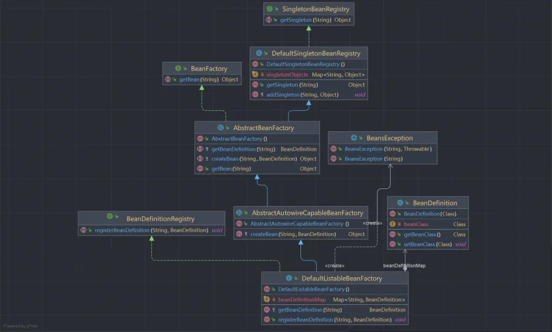
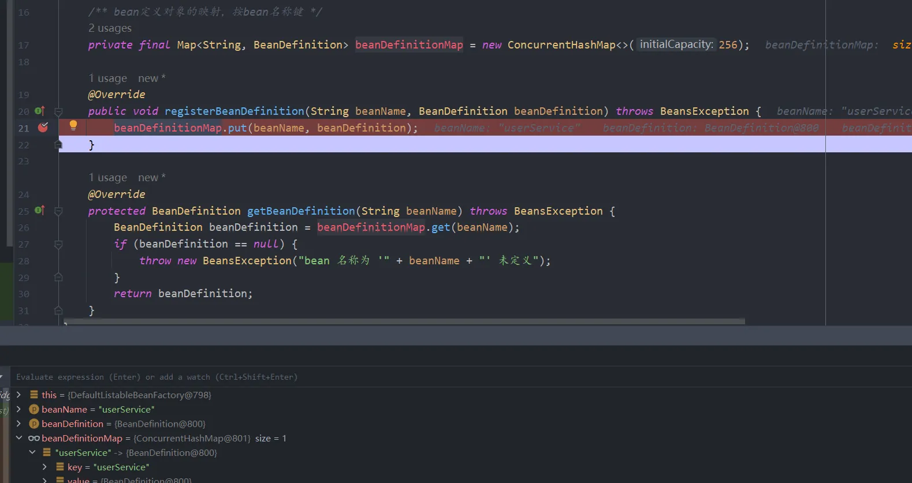
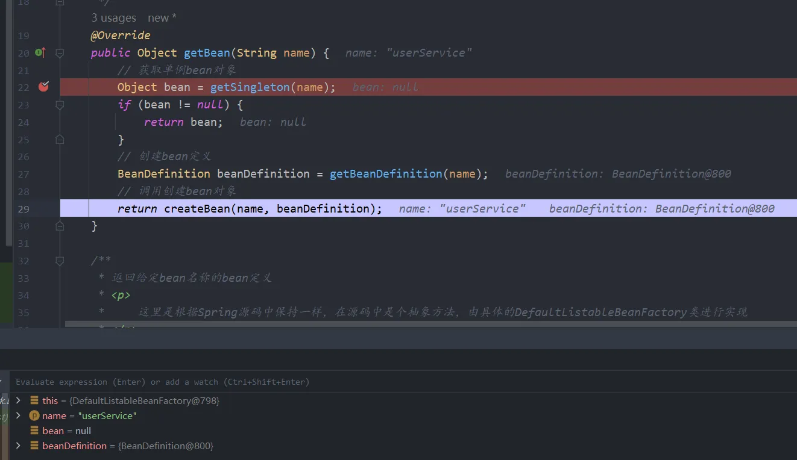
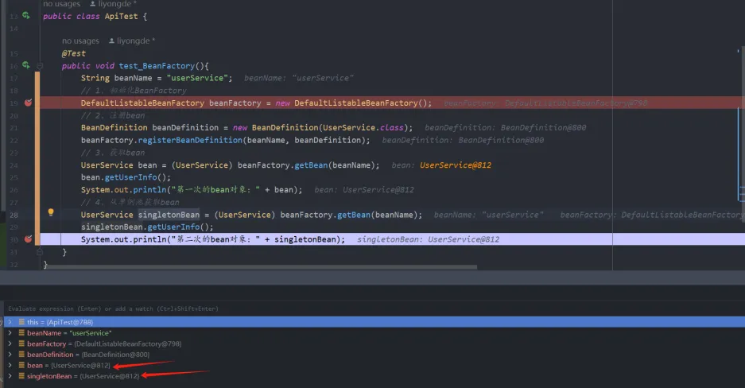

# 第二章、进一步理解Bean的创建与单例Bean
## 一、前言
经过上一篇文章学习了Spring Bean的简单创建，这章就来学习Bean的定义、注册和获取，以及单例bean的实现。代码都会根据Spring源码相似，只是做了简化版，至于包名和类名会保持一直，一步一步深入学习。<br />本章节是对Spring IOC容器的Bean定义、注册、获取进一步的学习理解。我们知道在Spring框架中是采用了许多的设计模式，本次学习会接触到单例模式和模板模式。其实也就那么一回事，这些模式也都是类的继承、实现接口、抽象类的继承，这样能够很好的隔离开各个业务功能。
## 二、思路
本地案例是实现单例bean的获取与注册，主要实现方法是在bean工厂注册bena对象的时候，会以变量名为key来存储创建的bean对象，等到第二次需要获取bean的时候，直接在单例bean对象集合中获取。<br />首先需要定义一个bean工厂接口类（BeanFactory），里面提供一个getBean(String name)方法，通过子类去实现这个方法来根据bean名称获取bean对象。本次实现的是单例bean，所以需要有个单例bean的注册器接口类（SingletonBeanRegistry），提供一个getSingleton(String name)方法来获取单例bean，主要由子类（DefaultSingletonBeanRegistry）来实现这个获取单例bean，同时也需要定义一个用来添加单例bean的方法。在注册bean时需要bean定义的注册，这样才知道你这个是什么类的bean对象，因此需要bean定义的注册器接口（BeanDefinitionRegistry），提供registerBeanDefinition(String beanName, BeanDefinition beanDefinition)进行bean定义的注册。最后由默认的bean工厂（DefaultListableBeanFactory）来实现对bean定义的注册存储和获取。
> 在Spring框架中，运用了抽象类、实现类、接口类、继承等，彼此之间存在着实现、继承的依赖关系，如果直接看源码会十分难受，但是如果一步一步进行拆开来看的话，就会相对简单点。

## 三、单例Bean
本次学习就实现单例Bean，在Spring框架中，默认也就是单例Bean，但是可以通过注解来指定。简单地说，单例作用域确保每个 Spring IoC 容器中只存在一个该 bean 的实例。Spring 容器在第一次请求该 bean 时创建一个实例，并且在后续的请求中，都会返回这个已创建的实例。
## 四、实践
本次使用的demo类的结构如下，代码可以看git的v2分支。
```stex
cn.abridge.springframework.beans
├── BeansException.java
└── factory
    ├── BeanFactory.java
    ├── config
    │   ├── BeanDefinition.java
    │   └── SingletonBeanRegistry.java
    └── support
        ├── AbstractAutowireCapableBeanFactory.java
        ├── AbstractBeanFactory.java
        ├── BeanDefinitionRegistry.java
        ├── DefaultListableBeanFactory.java
        └── DefaultSingletonBeanRegistry.java
```
### 1、类图
如图所示，本次实现的案例的类图<br />

<br />本次案例的实现所使用的类名、包名、方法名都基本与Spring源码一致，在学习这些代码的时候，可以尝试到Spring源码中查看对应类的继承关系以及方法。<br />接口定义

- 首先是bean工厂的接口（BeanFactory），提供的getBean(String name)方法由子类AbstractBeanFactory去实现。
- 单例bean的获取接口（SingletonBeanRegistry），提供的getSingleton(String beanName)方法由子类DefaultSingletonBeanRegistry去实现。
- bean定义的注册接口（BeanDefinitionRegistry），提供的registerBeanDefinition(String beanName, BeanDefinition beanDefinition)由子类DefaultListableBeanFactory去实现。
- 这里有些类采用了抽象类继承抽象类的方法，能够实现各自所需要实现的功能，专注各自的方法模块。
### 2、接口类
#### 2.1 BeanFactory 接口
```java
package cn.abridge.springframework.beans.factory;

import cn.abridge.springframework.beans.BeansException;

/**
 * @Author: lyd
 * @Date: 2024/3/19 20:45
 * @Description: bean工厂
 */
public interface BeanFactory {

    /**
     * 获取bean
     * @param name bean名
     * @return bean对象
     * @throws BeansException 如果拿不到bean
     */
    Object getBean(String name) throws BeansException;
}
```
#### 2.2 SingletonBeanRegistry 单例bean的注册器接口
这里定义的是获取单例bean，在Spring源码中会定义`void registerSingleton(String beanName, Object singletonObject);`注册单例bean。
```java
package cn.abridge.springframework.beans.factory.config;

/**
 * @Author: lyd
 * @Date: 2024/3/20 21:12
 * @Description: 单例注册接口
 */
public interface SingletonBeanRegistry {
    /**
     * 获取单例bean对象
     * 返回以给定名称注册的(原始)单例对象。
     * @param beanName
     * @return
     */
    Object getSingleton(String beanName);
}
```
#### 2.3 BeanDefinitionRegistry Bean定义的注册接口
```java
package cn.abridge.springframework.beans.factory.support;

import cn.abridge.springframework.beans.BeansException;
import cn.abridge.springframework.beans.factory.config.BeanDefinition;

/**
 * @Author: lyd
 * @Date: 2024/3/20 22:29
 * @Description: bean定义注册器
 */
public interface BeanDefinitionRegistry {

    /**
     * bean注册器接口
     * @param beanName bean名称
     * @param beanDefinition bean定义
     * @throws BeansException 统一异常，在spring源码中是BeanDefinitionStoreException
     */
    void registerBeanDefinition(String beanName, BeanDefinition beanDefinition)
    throws BeansException;
}
```
### 3、Bean定义（BeanDefinition）
接下来需要对bean定义类做一下改动，这里我们原本是直接存储对象Object类，现在我们存储为Class对象，这样在容器中就能够调用newInstance()来实例化。
```java
package cn.abridge.springframework.beans.factory.support;

import cn.abridge.springframework.beans.BeansException;
import cn.abridge.springframework.beans.factory.config.BeanDefinition;

/**
 * @Author: lyd
 * @Date: 2024/3/20 22:29
 * @Description: bean定义注册器
 */
public interface BeanDefinitionRegistry {

    /**
     * bean注册器接口
     * @param beanName bean名称
     * @param beanDefinition bean定义
     * @throws BeansException 统一异常，在spring源码中是BeanDefinitionStoreException
     */
    void registerBeanDefinition(String beanName, BeanDefinition beanDefinition)
            throws BeansException;
}
```
### 4、单例的实现（DefaultSingletonBeanRegistry）
我们已经创建了单例接口`SingletonBeanRegistry`，现在就需要来实现单例接口的getSingleton(String beanName)方法。
```java
package cn.abridge.springframework.beans.factory.support;

import cn.abridge.springframework.beans.factory.config.SingletonBeanRegistry;

import java.util.HashMap;
import java.util.Map;

/**
 * @Author: lyd
 * @Date: 2024/3/20 21:15
 * @Description: 默认单例bean对象的注册器
 */
public class DefaultSingletonBeanRegistry implements SingletonBeanRegistry {

    /** 单例bean注册的集合（存放单例bean对象） */
    private final Map<String, Object> singletonObjects = new HashMap<>();

    @Override
    public Object getSingleton(String beanName) {
        return singletonObjects.get(beanName);
    }

    /**
     * 注册bean
     * @param beanName bean名
     * @param singletonObject 单例bean对象
     */
    protected void addSingleton(String beanName, Object singletonObject) {
        singletonObjects.put(beanName, singletonObject);
    }
}
```
这里定义了内存变量来存储单例bean对象，获取bean对象的时候通过bean名到集合中获取就行。这里还需要将单例bean存储进去的方法，这里的使用是在AbstractAutowireCapableBeanFactory#createBean(String beanName, BeanDefinition mbd)进行实例化bean对象的时候把对象存到单例池中。
### 5、获取Bean对象的实现（AbstractBeanFactory）
这里通过一个抽象类bean工厂来完成对Bean对象的获取，继承DefaultSingletonBeanRegistry类，实现了BeanFactory的接口类，实现其未实现的getBean(String name)方法。
```java
package cn.abridge.springframework.beans.factory.support;

import cn.abridge.springframework.beans.BeansException;
import cn.abridge.springframework.beans.factory.BeanFactory;
import cn.abridge.springframework.beans.factory.config.BeanDefinition;

/**
 * @Author: lyd
 * @Date: 2024/3/20 21:33
 * @Description: 抽象类定义模板方法
 */
public abstract class AbstractBeanFactory extends DefaultSingletonBeanRegistry implements BeanFactory {

    /**
     * 实现BeanFactory获取bean对象
     * @param name bean名
     * @return bean对象
     */
    @Override
    public Object getBean(String name) {
        // 获取单例bean对象
        Object bean = getSingleton(name);
        if (bean != null) {
            return bean;
        }
        // 创建bean定义
        BeanDefinition beanDefinition = getBeanDefinition(name);
        // 调用创建bean对象
        return createBean(name, beanDefinition);
    }

    /**
     * 返回给定bean名称的bean定义
     * <p>
     *     这里是根据Spring源码中保持一样，在源码中是个抽象方法，由具体的DefaultListableBeanFactory类进行实现
     * </p>
     * @param beanName bean名称
     * @return bean定义
     * @throws BeansException 抛出的bean异常
     */
    protected abstract BeanDefinition getBeanDefinition(String beanName) throws BeansException;

    /**
     * 获取bean对象
     * <p>
     *     这里与spring源码不同的一点是，这里少了显式参数
     * </p>
     * @param beanName bean名称
     * @param mbd bean定义
     * @return bean对象
     * @throws BeansException 抛出的bean异常
     */
    protected abstract Object createBean(String beanName, BeanDefinition mbd) throws BeansException;
}
```
这里采用了模板模式，类中实现了BeanFactory#getBean，获取bean定义的方法和获取bean实例化的方法是由不同的子类去实现，这样能够做到功能拆分，各个类各司其职。因为继承了DefaultSingletonBeanRegistry（单例bean注册器），所以能够直接调用父类的getSingleton(name)，根据名称获取单例集合中的bean对象。如果获取的bean对象是空，那么就会获取对应bean定义，然后在实例化bean对象。
### 6、实例化Bean对象（AbstractAutowireCapableBeanFactory）
在Spring源码中，还会去实现AutowireCapableBeanFactory接口，能够实现自动装配。这里就实现了对bean的实例化。
```java
package cn.abridge.springframework.beans.factory.support;

import cn.abridge.springframework.beans.BeansException;
import cn.abridge.springframework.beans.factory.config.BeanDefinition;

/**
 * @Author: lyd
 * @Date: 2024/3/20 22:10
 * @Description: 实例化Bean类 自动装配能力Bean工厂, 在spring源码中还会去实现AutowireCapableBeanFactory，这里就简单操作
 */
public abstract class AbstractAutowireCapableBeanFactory extends AbstractBeanFactory {

    /**
     * 创建bean对象（生产bean实例）
     * @param beanName bean名称
     * @param mbd bean定义
     * @return bean实例
     * @throws BeansException bean异常
     */
    @Override
    protected Object createBean(String beanName, BeanDefinition mbd) throws BeansException {
        Object bean = null;
        try {
            // 创建bean实例
            bean = mbd.getBeanClass().newInstance();
        } catch (InstantiationException | IllegalAccessException e) {
            throw new BeansException("bean对象的初始化失败!");
        }
        // 添加单例bean
        addSingleton(beanName, bean);
        return bean;
    }
}
```
AbstractAutowireCapableBeanFactory是个抽象类，继承了抽象类AbstractBeanFactory，实现了父类AbstractBeanFactory的抽象方法createBean()，主要是用来实例化bean对象，并将对象添加到单例中。
### 7、Bean工厂（DefaultListableBeanFactory）
DefaultListableBeanFactory是bean工厂的重要实现类，是个十分核心的类。它继承了AbstractAutowireCapableBeanFactory并且实现了BeanDefinitionRegistry接口。
```java
package cn.abridge.springframework.beans.factory.support;

import cn.abridge.springframework.beans.BeansException;
import cn.abridge.springframework.beans.factory.config.BeanDefinition;

import java.util.Map;
import java.util.concurrent.ConcurrentHashMap;

/**
 * @Author: lyd
 * @Date: 2024/3/20 22:27
 * @Description: 默认的Bean工厂 （核心类）
 */
public class DefaultListableBeanFactory extends AbstractAutowireCapableBeanFactory implements BeanDefinitionRegistry {

    /** bean定义对象的映射，按bean名称键 */
    private final Map<String, BeanDefinition> beanDefinitionMap = new ConcurrentHashMap<>(256);

    @Override
    public void registerBeanDefinition(String beanName, BeanDefinition beanDefinition) throws BeansException {
        beanDefinitionMap.put(beanName, beanDefinition);
    }

    @Override
    protected BeanDefinition getBeanDefinition(String beanName) throws BeansException {
        BeanDefinition beanDefinition = beanDefinitionMap.get(beanName);
        if (beanDefinition == null) {
            throw new BeansException("bean 名称为 '" + beanName + "' 未定义");
        }
        return beanDefinition;
    }
}
```
DefaultListableBeanFactory继承了AbstractAutowireCapableBeanFactory，所以也就相当于继承了AbstractBeanFactory所以也就有了这一系列的功能，实现了AbstractBeanFactory#getBeanDefinition方法。不仅如此，DefaultListableBeanFactory还实现了BeanDefinitionRegistry接口，实现了registerBeanDefinition(String beanName, BeanDefinition beanDefinition)方法。<br />在这个类中，主要完成是存储bean定义，并且通过bean名称获取对应的bean定义。
## 五、测试
首先，我们需要模拟spring注册bean，也就需要有个bean工厂。初始化bean工厂之后，需要对bean进行注册，这里注册bean定义的时候，是没有考虑到携带参数的，是个无参的形式。之后通过bean工厂获取bean对象。
```java
package cn.abridge.springframework.test;

import cn.abridge.springframework.beans.factory.config.BeanDefinition;
import cn.abridge.springframework.beans.factory.support.DefaultListableBeanFactory;
import cn.abridge.springframework.test.bean.UserService;
import org.junit.Test;

/**
 * @Author: lyd
 * @Date: 2024/3/19 20:54
 * @Description: 测试类
 */
public class ApiTest {

    @Test
    public void test_BeanFactory(){
        String beanName = "userService";
        // 1、初始化BeanFactory
        DefaultListableBeanFactory beanFactory = new DefaultListableBeanFactory();
        // 2、注册bean
        BeanDefinition beanDefinition = new BeanDefinition(UserService.class);
        beanFactory.registerBeanDefinition(beanName, beanDefinition);
        // 3、获取bean
        UserService bean = (UserService) beanFactory.getBean(beanName);
        bean.getUserInfo();
        System.out.println("第一次的bean对象：" + bean);
        // 4、从单例池获取bean
        UserService singletonBean = (UserService) beanFactory.getBean(beanName);
        singletonBean.getUserInfo();
        System.out.println("第二次的bean对象：" + singletonBean);
    }
}
```
接着我们进行调试测试<br />**① 注册bean定义**<br />注册bean定义就是将通过构造方法创建的bean定义对象和bean名称，存到Map集合中。<br />

<br />**② 获取bean对象**<br />一开始单例bean集合还没有数据，因此会通过AbstractAutowireCapableBeanFactory#createBean方法进行创建实例化bean对象，并且将这个对象存到单例bean集合中。<br />

<br />**③ 第二次获取bean对象**<br />我们通过调试可以看到，当第二次获取bean对象的时候，就是直接从缓存集合中进行获取，可以看实例化对象是同一个。<br />

<br />**④ 输出结果**
```java
获取用户信息!!!
第一次的bean对象：cn.abridge.springframework.test.bean.UserService@3e6fa38a
获取用户信息!!!
第二次的bean对象：cn.abridge.springframework.test.bean.UserService@3e6fa38a
```
## 六、总结
本次对Bean的创建和获取进一步的学习，相比Spring源码来说还是有很大的差距，这只是个删减版，主要是了解这些设计方式，其实里面更多的也就是抽象类与继承、接口实现等。
