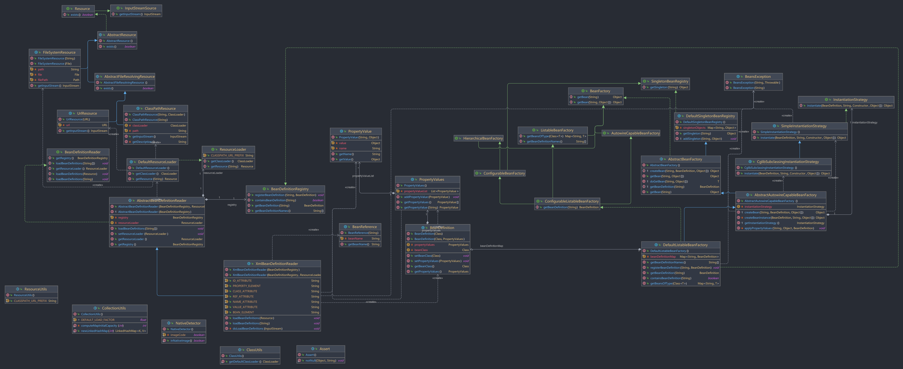
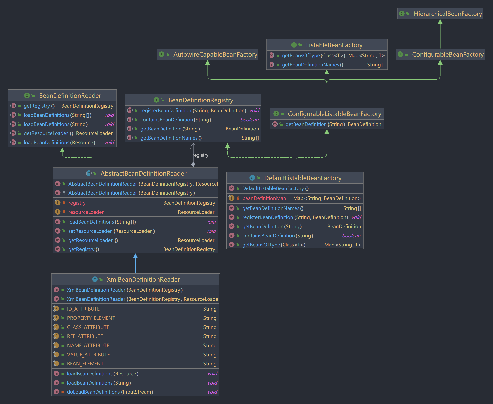
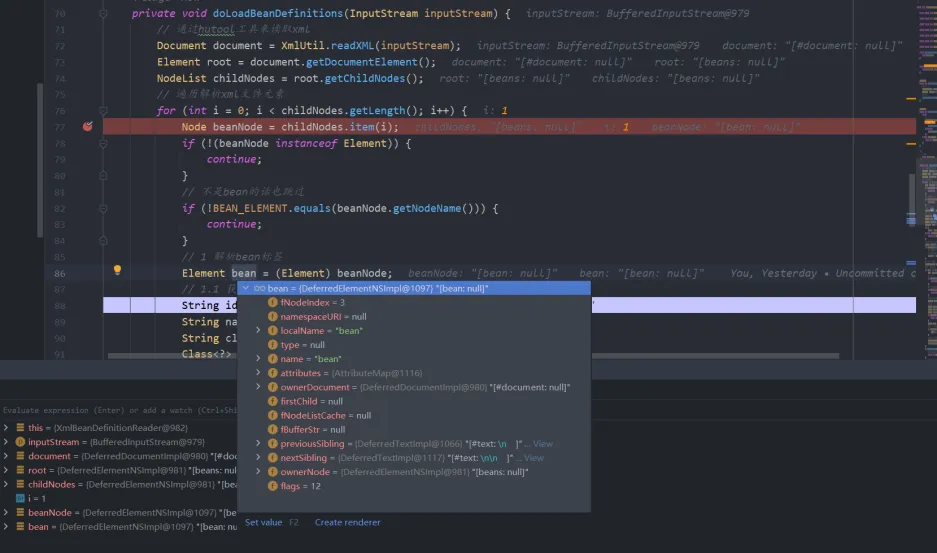

# 第五章、读取资源文件与解析XML
## 1 前言
上一篇文章已经是介绍了Bean对象的创建进一步处理，对Bean对象的属性填充以及依赖注入，都做了简单的学习。那么这章节就来学习Spring是如何读取资源文件的以及对xml的解析。这章节将会有两个部分来完成，第一部分是完成读取资源文件，第二部是通过xml文件来进行对Bean对象的注册，里面也包括了属性的填充和依赖的注入。本次依然会尽可能的与Spring源码一致，学习方式依旧可以打开Spring5.x的源码对照学习。
## 2 思路
实现读取资源文件并不难，主要是通过资源加载器获取到对应的资源处理器(handle)，通过不同的handle去实现不同获取input输入流，获取输入流是本次的核心，这样从文件中读取数据。有了这个前提，我们就可以实现解析xml获取bean对象。主要思想是通过获取资源的输入流，在通过hutool工具来解析xml文件，并创建一个Document对象，这里面包含了XML文件的完整结构，根据标签名字获取值，并将其转换成容器内部的BeanDefinition对象，注册BeanDefinition到bean定义注册器中。
### 2.1 前置知识
#### 2.1.1 InputStream
Java中的InputStream是一个表示字节输入流的抽象类，它是所有字节输入流类的超类，提供了读取字节数据的通用方法。它位于java.io包中，是Java标准I/O库的一部分。<br />而在Spring框架中，需要定义一个接口来获取资源的输入流，由于不同的组件可能需要从不同的位置读取数据，如文件系统、网络连接、类路径资源等，所以需要由不同方式去实现获取这个流。
## 3 实践
本次使用的demo类的结构如下，代码可以看git的v5分支
```
cn.abridge.springframework
    ├─beans
    │  │  BeansException.java
    │  │  PropertyValue.java
    │  │  PropertyValues.java
    │  │  
    │  └─factory
    │      ├─BeanFactory.java
    │      ├─HierarchicalBeanFactory.java
    │      ├─ListableBeanFactory.java
    │      │  
    │      ├─config
    │      │    ├─AutowireCapableBeanFactory.java
    │      │    ├─BeanDefinition.java
    │      │    ├─BeanReference.java
    │      │    ├─ConfigurableBeanFactory.java
    │      │    ├─ConfigurableListableBeanFactory.java
    │      │    └─SingletonBeanRegistry.java
    │      │      
    │      ├─support
    │      │    ├─AbstractAutowireCapableBeanFactory.java
    │      │    ├─AbstractBeanDefinitionReader.java
    │      │    ├─AbstractBeanFactory.java
    │      │    ├─BeanDefinitionReader.java
    │      │    ├─BeanDefinitionRegistry.java
    │      │    ├─CglibSubclassingInstantiationStrategy.java
    │      │    ├─DefaultListableBeanFactory.java
    │      │    ├─DefaultSingletonBeanRegistry.java
    │      │    ├─InstantiationStrategy.java
    │      │    └─SimpleInstantiationStrategy.java
    │      │      
    │      └─xml
    │         └──XmlBeanDefinitionReader.java
    │              
    ├─core
    │  ├─NativeDetector.java
    │  │  
    │  └─io
    │     ├─AbstractFileResolvingResource.java
    │     ├─AbstractResource.java
    │     ├─ClassPathResource.java
    │     ├─DefaultResourceLoader.java
    │     ├─FileSystemResource.java
    │     ├─InputStreamSource.java
    │     ├─Resource.java
    │     ├─ResourceLoader.java
    │     └─UrlResource.java
    │          
    └─util
        ├─Assert.java
        ├─ClassUtils.java
        ├─CollectionUtils.java
        └─ResourceUtils.java
```
### 3.1 类图

<br />这次类图看起来就比较庞大了，除了之前v4分支的代码外，增加了读取文件所需要的类，还有一些本次暂未用到，但都创建进来了，这个后续使用到会讲述。
<br />为了让每个类做到自己的职责，你会看到里面有许多的抽象类，在抽象类中重写各自得实现方式。<br />本次主要分为两大部分，分别是资源加载和xml资源解析。主要是靠实现Resource继承得InputStreamSource中的getInputStream()方法，根据三种不同的资源加载器，其中包括ClassPath、系统文件、云端文件，这三种不同的加载方式，都各自实现了获取输入流的方法。通过DefaultResourceLoader获取最后具体的资源处理器。最后通过xml文件的bean读取器(XmlBeanDefinitionReader)，去加载xml文件中的bean元素，将加载完整的bean定义注册到bean定义容器中。<br />还有一些做了变动，BeanDefinitionRegistry在bean定义注册器中新增了从容器获取bean名称的bean对象、检测注册中心是否存在该bean名称的bean对象以及获取bean定义注册中心中的所有bean的名称。我们再看以下类图：<br />

<br />在bean定义读取器(BeanDefinitionReader)中定义了加载bean定义，再由抽象类AbstractBeanDefinitionReader去继承bean定义读取器接口，实现了属于它(AbstractBeanDefinitionReader)所担任的职责方法，最终的加载bean定义由XmlBeanDefinitionReader去实现。

> 这里介绍一下本次代码的新增与修改
> 新增：
> - AutowireCapableBeanFactory
> - ConfigurableBeanFactory
> - ConfigurableListableBeanFactory
> - AbstractBeanDefinitionReader
> - BeanDefinitionReader
> - XmlBeanDefinitionReader
> - HierarchicalBeanFactory
> - ListableBeanFactory
> - AbstractFileResolvingResource
> - AbstractResource
> - ClassPathResource
> - DefaultResourceLoader
> - FileSystemResource
> - InputStreamSource
> - Resource
> - ResourceLoader
> - UrlResource
> - ClassUtils
> - CollectionUtils
> - ResourceUtils
> 
修改：
> - BeanDefinitionRegistry
> - DefaultListableBeanFactory

### 3.2 资源加载
#### 3.2.1 获取输入流的接口定义
要读取文件资源，最主要的是输入流，因为三种不同的流文件操作：classPath、FileSystem、URL，所以提供一个getInputStream()的方法，来让不同的方式分别去实现。这里采用和Spring框架一样，通过接口类InputStreamSource中定义getInputStream()方法。<br />①、InputStreamSource
```java
package cn.abridge.springframework.core.io;

import java.io.IOException;
import java.io.InputStream;

/**
 * 类的源对象的简单接口 {@link InputStream} 。
 *
 * <p>这是Spring更广泛的 {@link Resource}接口的基础接口。</p>
 *
 * 可以使用Spring的{@link ByteArrayResource}或任何基于文件的{@code Resource}实现作为具体的实例，
 * 这使得可以多次阅读底层的内容流。
 * 例如，这使得此接口作为邮件附件的抽象内容源非常有用。
 * @Author: lyd
 * @Date: 2024/3/31 21:18
 * @Description: 类的源对象的简单接口 {@link InputStream}
 */
public interface InputStreamSource {

    /**
     * 返回一个输入流
     * @return 输入流
     * @throws IOException 如果无法打开输入流
     */
    InputStream getInputStream() throws IOException;
}
```
②、Resource
```java
package cn.abridge.springframework.core.io;

/**
 * @Author: lyd
 * @Date: 2024/3/31 21:17
 * @Description:
 */
public interface Resource extends InputStreamSource {
    /**
     * todo: 资源校验是否存在
     * <p>确定此资源是否实际存在于物理形态中。
     * 此方法执行明确的存在性检查，而{@code Resource} 句柄的存在只保证了一个有效的描述符句柄。
     * @return true或者false
     */
    boolean exists();
}
```
Resource接口是Spring框架中用于资源抽象描述的核心接口。它提供了一种统一的方式来访问底层资源，如文件或类路径资源，而不需要关心资源的具体类型。<br />在这个接口中，Spring框架中还有许多的方法，包括exists()、isReadable()、isOpen()等等，具体可以看Spring源码中Resource类。在本文就先提供一个方法，在子类中并没有具体去实现。
> Resource这是一个资源描述符的接口，它抽象出底层资源的实际类型，例如文件或类路径资源。
> 如果每个资源在物理形态下存在，那么可以为其开启一个输入流，但是，只有某些资源才能返回URL或文件句柄(handle)。具体的行为取决于实现方式。

③、ClassPathResource<br />这里与Spring源码保持一致，先去继承抽象类`AbstractFileResolvingResource`，而这个抽象类也继承了抽象类`AbstractResource`，最后`AbstractResource`实现了`Resource`接口。实际上`ClassPathResource`是`Resource`接口的一个实现。
> 类路径是Java用来查找加载class文件和其他资源（如配置文件）的一组路径。当应用程序运行时，类加载器会使用这些路径来查找这些资源。ClassPathResource对类路径资源的访问进行了封装，使得在代码中访问这些资源变得简单。

```java
package cn.abridge.springframework.core.io;

import cn.abridge.springframework.util.Assert;
import cn.abridge.springframework.util.ClassUtils;
import com.sun.istack.internal.Nullable;

import java.io.FileNotFoundException;
import java.io.IOException;
import java.io.InputStream;

/**
 * @Author: lyd
 * @Date: 2024/3/31 21:24
 * @Description:
 */
public class ClassPathResource extends AbstractFileResolvingResource {
    private final String path;

    @Nullable
    private ClassLoader classLoader;

    public ClassPathResource(String path) {
        this(path, (ClassLoader) null);
    }
    public ClassPathResource(String path, ClassLoader classLoader) {
        Assert.notNull(path, "Path 一定不能为空");
        this.path = path;
        // 初始化classLoader的时候可以为null
        this.classLoader = (classLoader != null ? classLoader : ClassUtils.getDefaultClassLoader());
    }
    @Override
    public InputStream getInputStream() throws IOException {
        InputStream is;
        // 获取输入流，在Spring源码中，还需要使用本类获取，这里暂时不定义
        if (this.classLoader != null) {
            is = classLoader.getResourceAsStream(path);
        } else {
            is = ClassLoader.getSystemResourceAsStream(path);
        }
        if (is == null) {
            // 如果输入流还是空，抛出异常
            throw new FileNotFoundException(getDescription() + " 不存在，无法打开。");
        }
        return is;
    }
    private String getDescription() {
        StringBuilder builder = new StringBuilder("类资源路径 [");
        builder.append(this.path);
        builder.append(']');
        return builder.toString();
    }
}
```
ClassPathResource用于提供对类路径（classpath）下资源的访问。而这里是通过ClassLoader去获取classPath指定的文件的输入流。主要的核心是`ClassLoader.getSystemResourceAsStream(path)`。这个在构造器的时候就会获取这个类加载器(ClassLoader)。这里与Spring源码大差不差，通过Spring封装的类`ClassUtils#getDefaultClassLoader`来实现。代码如下：
```java
public abstract class ClassUtils {
    @Nullable
    public static ClassLoader getDefaultClassLoader() {
        ClassLoader cl = null;
        try {
            cl = Thread.currentThread().getContextClassLoader();
        } catch (Throwable ex) {
            // 线程上下文类加载器获取不到
        }
        if (cl == null) {
            // 没有线程上下文类加载器->使用该类的类加载器。
            cl = ClassUtils.class.getClassLoader();
            if (cl == null) {
                // getClassLoader()返回null表示引导类加载器。
                try {
                    cl = ClassLoader.getSystemClassLoader();
                } catch (Throwable ex) {
                    // 无法访问系统类加载器 - emmm，也许调用者可以接受null...
                }
            }
        }
        return cl;
    }
}
```
这里关于类加载器的知识点，可以看看我以前发表的博客文章：[【JVM系列】- 类加载子系统与加载过程_子类加载的过程-CSDN博客](https://blog.csdn.net/qq_43843951/article/details/133894758)
> 总的来说，ClassPathResource是Spring中处理类路径下资源的一个方便且强大的工具，它尤其适用于加载配置文件和库内的资源文件。通过封装底层的资源访问逻辑，ClassPathResource为Spring框架中的资源管理提供了一致性和灵活性。

④、FileSystemResource<br />`FileSystemResource`继承了抽象类`AbstractResource`，实际上最终也是实现了`Resource#getInputStream()`。
> Spring 框架中的 FileSystemResource 是 org.springframework.core.io 包提供的一个类，它是 Resource 接口的具体实现，用于访问文件系统中的资源。与 ClassPathResource 主要用于访问类路径下的资源不同，FileSystemResource 是专门设计来处理文件系统资源的，比如那些在目录中的文件或文件夹。

```java
package cn.abridge.springframework.core.io;

import cn.abridge.springframework.util.Assert;
import com.sun.istack.internal.Nullable;

import java.io.*;
import java.nio.file.Files;
import java.nio.file.NoSuchFileException;
import java.nio.file.Path;

/**
 * @Author: lyd
 * @Date: 2024/3/31 21:47
 * @Description: 将url解析为文件引用的资源的抽象基类, 例如：{@link UrlResource} or {@link ClassPathResource}。
 * 注意：这里在Spring源码中还会实现WritableResource类，用来提供OutputStream访问器
 */
public class FileSystemResource extends AbstractResource {
    private final String path;
    @Nullable
    private final File file;
    private final Path filePath;
    public FileSystemResource(String path) {
        Assert.notNull(path, "路径一定不能为空");
        this.path = path;
        this.file = new File(path);
        this.filePath = file.toPath();
    }
    public FileSystemResource(File file) {
        Assert.notNull(file, "文件一定不能为空");
        this.file = file;
        this.path = file.getPath();
        this.filePath = file.toPath();
    }
     /**
     * 这个实现为底层文件打开一个NIO文件流。
     * @see java.nio.file.Files#newInputStream(Path, java.nio.file.OpenOption...)
     */
    @Override
    public InputStream getInputStream() throws IOException {
        try {
            return Files.newInputStream(this.filePath);
        }
        catch (NoSuchFileException ex) {
            throw new FileNotFoundException(ex.getMessage());
        }
    }
}
```
以上提供了两种方式，一种是直接根据路径来对变量进行赋值，另一种是已经获取了File文件信息，通过File实体内部信息给变量赋值。并且通过java.nio.file.Files#newInputStream去实现为底层文件打开一个NIO文件流。<br />⑤、UrlResource<br />这里采用和Spring源码一致，让UrlResource去继承抽象类`AbstractFileResolvingResource`，而这个抽象类也继承了抽象类`AbstractResource`，最后`AbstractResource`实现了Resource接口。
> Spring框架中的UrlResource是org.springframework.core.io包下的一个类，用于访问那些可以通过URL进行标识的资源。UrlResource实现了Resource接口，通过标准的Java网络编程API来访问和操作URL指向的资源。这些资源可以位于文件系统中，也可以通过HTTP、HTTPS、FTP等网络协议获取。

```java
package cn.abridge.springframework.core.io;

import cn.abridge.springframework.util.Assert;

import java.io.IOException;
import java.io.InputStream;
import java.net.HttpURLConnection;
import java.net.URL;
import java.net.URLConnection;

/**
 * @Author: lyd
 * @Date: 2024/3/31 22:13
 * @Description:
 */
public class UrlResource extends AbstractFileResolvingResource {

    /**
     * 原始URL，用于实际访问。
     */
    private final URL url;

    public UrlResource(URL url) {
        Assert.notNull(url, "URL一定不能为空");
        this.url = url;
    }

    @Override
    public InputStream getInputStream() throws IOException {
        URLConnection con = this.url.openConnection();
        try {
            return con.getInputStream();
        } catch (IOException ex) {
            // 如果启用，就关闭HTTP连接。
            if (con instanceof HttpURLConnection) {
                ((HttpURLConnection) con).disconnect();
            }
            throw ex;
        }
    }
}
```
#### 3.2.2 资源加载器
对资源加载的方式不一样，资源加载器会通过加载资源的策略接口，让具体的子类去实现获取资源handle，通过统一的处理，只需要传入资源路径，就能够返回对应的资源handle，就可以调用对应的方法获取输入流。<br />①、ResourceLoader<br />`ResourceLoader`（资源加载器）， 提供了一个用来加载资源（如文件、类路径资源等）的策略接口。这里还提供了获取资源加载器使用的类加载器的接口`getClassLoader()`，在本次中是没有具体实现。
```java
/**
 * @Author: lyd
 * @Date: 2024/4/1 20:36
 * @Description: 加载资源的策略接口(例如，类路径或文件系统资源)
 */
public interface ResourceLoader {
    /** 用于从类路径加载的伪URL前缀: "classpath:". */
    String CLASSPATH_URL_PREFIX = ResourceUtils.CLASSPATH_URL_PREFIX;

    /**
     * 返回指定资源位置的资源{@code Resource}句柄。
     * @param location 资源位置
     * @return 相关的资源处理器，不会返回{@code null}
     */
    Resource getResource(String location);

    /**
     * 暴露此资源加载器{@code ResourceLoader}使用的类加载器{@link ClassLoader} 。
     * @return {@code ClassLoader}
     */
    @Nullable
    ClassLoader getClassLoader();
}
```
如上代码，在`ResourceLoader`中，定义了一个通过指定的资源位置来返回对应的`Resource handle`。对于资源路径，Spring框架中提出了有几点要求：

- 必须支持完全限定的URL, e.g. "file:C:/test.dat"。
- 必须支持类路径伪URL, e.g. "classpath:test.dat"。
- 应支持相对文件路径, e.g. "WEB-INF/test.dat"。(这将是特定于实现的，通常由ApplicationContext实现提供。)

②、DefaultResourceLoader<br />`DefaultResourceLoader`是`ResourceLoader`接口的默认实现。通过不同的路径去调用不同的策略方法，从而获取对应的Resource handle，就上面所提到的三种：ClassPath、FileSystem、URL。
```java
public class DefaultResourceLoader implements ResourceLoader {
    @Override
    public Resource getResource(String location) {
        Assert.notNull(location, "地址不能为空");
        if (location.startsWith(CLASSPATH_URL_PREFIX)) {
            // 这里直接去掉前缀，所以在构造函数的时候就不需要进行前缀去除
            return new ClassPathResource(location.substring(CLASSPATH_URL_PREFIX.length()));
        } else {
            try {
                // 尝试将路径解析为URL
                URL url = new URL(location);
                // 这里就不在做校验，直接返回
                return new UrlResource(url);
            } catch (MalformedURLException e) {
                // URL无法解析资源路径, 当成文件系统下的资源处理
                return new FileSystemResource(location);
            }
        }
    }

    @Override
    public ClassLoader getClassLoader() {
        // todo: 过去类加载器，目前暂时没实现，后续实现
        return null;
    }
}
```
这里通过不同的路径去获取不同的Resource handle。这里与Spring框架不同的是，Spring在开头会自定义协议解析。
```java
for (ProtocolResolver protocolResolver : getProtocolResolvers()) {
   Resource resource = protocolResolver.resolve(location, this);
   if (resource != null) {
       return resource;
   }
}
```
这里会进行遍历一系列的 ProtocolResolver 实例，并尝试用每一个去解析传入的 location。如果解析成功（即返回了一个非 null 的 Resource 对象），就直接返回这个资源。
#### 3.2.3 XML解析获取Bean
能够获取到文件资源后，接下来就是能够解析XML文件得到bean定义。这次会引入更多的接口类，主要是来与Spring源码保持一致性，方便了解Spring以及后期的学习。<br />由`BeanDefinitionReader`接口定义了获取资源加载器、获取bean定义注册器以及根据指定的资源/路径去加载bean定义的方法，由具体的子类去实现。通过抽象类`AbstractBeanDefinitionReader`来完成获取bean定义注册器以及资源加载器，因为在这个抽象类中，定义了bean定义注册器变量和资源加载器变量，这样就使得继承此类都能够得到这些信息。具体的实现加载XML资源文件以及解析XML获取Bean定义都是在`XmlBeanDefinitionReader`这个类中实现。<br />①、BeanDefinitionReader
```java
public interface BeanDefinitionReader {

    /**
     * 返回bean工厂来注册bean定义。
     * <p>工厂通过{@link BeanDefinitionRegistry}接口进行显示，封装了与bean定义处理相关的方法。</p>
     * @return bean定义注册器
     */
    BeanDefinitionRegistry getRegistry();

    /**
     * 返回用于bean类的类加载器。
     * <p>{@code null} 建议不要急于加载bean类，而是仅使用类名注册bean定义，相应的类将在以后（或永不）解析
     * @return
     */
    @Nullable
    ResourceLoader getResourceLoader();

    /**
     * 从指定的资源中加载bean定义。
     * @param resource 资源描述符
     * @throws BeansException 在遇到加载或解析错误的情况下
     */
    void loadBeanDefinitions(Resource resource) throws BeansException;

    /**
     * 从指定的资源位置加载bean定义。
     * @param location 资源位置，需要使用 {@code ResourceLoader} 进行加载。
     * （或者这个bean定义读取器的{@code ResourcePatternResolver}）。
     * @throws BeansException 一旦出现加载或解析错误
     */
    void loadBeanDefinitions(String location) throws BeansException;

    /**
     * 从指定的资源位置加载bean定义。
     * @param locations 资源位置，将使用这个bean定义读取器的{@code ResourceLoader}
     *    （或者 {@code ResourcePatternResolver}）进行加载。
     * @throws BeansException 一旦出现加载或解析错误
     */
    void loadBeanDefinitions(String... locations) throws BeansException;
}
```
bean定义读取器接口，规定了带有 Resource 和 位置参数的加载方法。提供了获取bean定义的注册器和获取资源加载器以及根据资源路径加载资源的相关方法。<br />②、AbstractBeanDefinitionReader<br />Spring框架中的 AbstractBeanDefinitionReader 是用于加载Bean定义的类的一个抽象基类。它为读取Bean定义提供了基础结构，也就是将应用上下文中配置的Bean解析为Spring内部数据结构。具体描述如下：
> 资源加载：该类与Spring的资源加载抽象紧密集成。它使用 ResourceLoader 来加载配置资源，这些资源可以是XML配置文件、注解或任何其他形式。
> Bean定义注册：读取到的Bean定义需要被注册到一个Bean工厂中。AbstractBeanDefinitionReader 通过持有一个 BeanDefinitionRegistry 引用用来实现这一功能，实际注册工作由实现了该接口的对象（通常是 DefaultListableBeanFactory 或其子类）进行。
> 环境抽象：它通过 EnvironmentCapable 接口柄进行环境（Environment）相关工作，比如处理占位符解析中的属性源（PropertySources）。
> 类加载器访问：它提供了访问 BeanClassLoader 的方式，方便在定义Bean的时候进行类的加载。
> Bean名称生成器：它可以持有一个 BeanNameGenerator，用于生成Bean的名称。
> 附加的Bean定义信息：它允许设置额外的Bean定义信息，例如Bean定义的源对象和Bean加载时使用的类加载器。

```java
public abstract class AbstractBeanDefinitionReader implements BeanDefinitionReader {
    private final BeanDefinitionRegistry registry;

    @Nullable
    private ResourceLoader resourceLoader;

    protected AbstractBeanDefinitionReader(BeanDefinitionRegistry registry) {
        this(registry, new DefaultResourceLoader());
    }

    public AbstractBeanDefinitionReader(BeanDefinitionRegistry registry, ResourceLoader defaultResourceLoader) {
        this.registry = registry;
        this.resourceLoader = defaultResourceLoader;
    }

    @Override
    public BeanDefinitionRegistry getRegistry() {
        return registry;
    }

    @Override
    public ResourceLoader getResourceLoader() {
        return resourceLoader;
    }

    /**
     * 设置用于资源位置的ResourceLoader。如果指定了ResourcePatternResolver，
     * 那么bean定义读取器将有能力解析资源模式到Resource数组。
     * @param resourceLoader 资源加载器
     */
    public void setResourceLoader(@Nullable ResourceLoader resourceLoader) {
        this.resourceLoader = resourceLoader;
    }

    @Override
    public void loadBeanDefinitions(String... locations) throws BeansException {
        Assert.notNull(locations, "路径不能为空");
        for (String location : locations) {
            loadBeanDefinitions(location);
        }
    }
}
```
因为获取XML里面的Bean元素后，需要将器注册到Bean定义注册器中，所以这里需要提供`BeanDefinitionRegistry`的实例。以便在XMLBean定义读取器中进行注册bean定义，本次的学习是没有去实现`EnvironmentCapable`方法。
> AbstractBeanDefinitionReader 本身并不提供具体的实现来解析Bean定义，它只是定义了一些公共逻辑和属性，真正的Bean定义解析由它的子类负责。
> - XmlBeanDefinitionReader：用于读取XML配置文件中的Bean定义。
> - PropertiesBeanDefinitionReader：用于从属性文件中读取Bean定义。
> - AnnotatedBeanDefinitionReader：用于读取由注解标记的类中的Bean定义。

③、XmlBeanDefinitionReader<br />XmlBeanDefinitionReader 是 Spring 框架中用于从 XML 文件加载 Bean 定义的一个具体实现类。它继承自 AbstractBeanDefinitionReader，专门解析 XML 配置文件并将其中定义的 Bean 转换为 Spring 容器可用的 BeanDefinition 对象。
```java
public class XmlBeanDefinitionReader extends AbstractBeanDefinitionReader {
    public static final String BEAN_ELEMENT = "bean";
    public static final String PROPERTY_ELEMENT = "property";
    public static final String ID_ATTRIBUTE = "id";
    public static final String NAME_ATTRIBUTE = "name";
    public static final String CLASS_ATTRIBUTE = "class";
    public static final String VALUE_ATTRIBUTE = "value";
    public static final String REF_ATTRIBUTE = "ref";
    public XmlBeanDefinitionReader(BeanDefinitionRegistry registry) {
        super(registry);
    }

    public XmlBeanDefinitionReader(BeanDefinitionRegistry registry, ResourceLoader defaultResourceLoader) {
        super(registry, defaultResourceLoader);
    }

    @Override
    public void loadBeanDefinitions(String location) throws BeansException {
        // 获取资源加载器
        ResourceLoader resourceLoader = getResourceLoader();
        Resource resource = resourceLoader.getResource(location);
        // 加载资源
        loadBeanDefinitions(resource);
    }

    @Override
    public void loadBeanDefinitions(Resource resource) throws BeansException {
        try {
            // 获取输入流
            InputStream inputStream = resource.getInputStream();
            try {
                doLoadBeanDefinitions(inputStream);
            } finally {
                inputStream.close();
            }
        } catch (IOException e) {
            throw new RuntimeException("解析XML文档[" + resource + "]出现 IOException", e);
        }
    }

    /**
     * 加载bean定义
     * @param inputStream 输入流
     */
    private void doLoadBeanDefinitions(InputStream inputStream) {
        // 通过hutool工具来读取xml
        Document document = XmlUtil.readXML(inputStream);
        Element root = document.getDocumentElement();
        NodeList childNodes = root.getChildNodes();
        // 遍历解析xml文件元素
        for (int i = 0; i < childNodes.getLength(); i++) {
            Node beanNode = childNodes.item(i);
            if (!(beanNode instanceof Element)) {
                continue;
            }
            // 不是bean的话也跳过
            if (!BEAN_ELEMENT.equals(beanNode.getNodeName())) {
                continue;
            }
            // 1 解析bean标签
            Element bean = (Element) beanNode;
            // 1.1 获取里面的参数
            String id = bean.getAttribute(ID_ATTRIBUTE);
            String name = bean.getAttribute(NAME_ATTRIBUTE);
            String className = bean.getAttribute(CLASS_ATTRIBUTE);
            Class<?> clazz = null;
            try {
                clazz = Class.forName(className);
            } catch (ClassNotFoundException e) {
                throw new RuntimeException(e);
            }
            // 1.2 id的优先级比name高
            String beanName = StrUtil.isNotEmpty(id) ? id : name;
            if (StrUtil.isEmpty(beanName)) {
                // 在Spring中，默认是第一个子母小写开头为bean名。
                // 如果id和name都为空，将类名的第一个字母转为小写后作为bean的名称
                beanName = StrUtil.lowerFirst(clazz.getSimpleName());
            }
            // 1.3 创建bean定义
            BeanDefinition beanDefinition = new BeanDefinition(clazz);
            // 2 填充bean下的属性
            for (int j = 0; j < bean.getChildNodes().getLength(); j++) {
                Node propertyNode = bean.getChildNodes().item(j);
                // 过滤不是元素
                if (!(propertyNode instanceof Element)) {
                    continue;
                }
                // 不是property标签也过滤
                if (!PROPERTY_ELEMENT.equals(propertyNode.getNodeName())) {
                    continue;
                }
                // 2.2 解析property标签元素
                Element property = (Element) propertyNode;
                // 2.3 获取参数，属性名-属性值 ref: 标记是否为依赖Bean
                String nameAttribute = property.getAttribute(NAME_ATTRIBUTE);
                String valueAttribute = property.getAttribute(VALUE_ATTRIBUTE);
                String refAttribute = property.getAttribute(REF_ATTRIBUTE);
                if (StrUtil.isEmpty(nameAttribute)) {
                    throw new BeansException("属性名不能为空！");
                }
                Object value = valueAttribute;
                // 如果是个依赖的Bean对象，就实例化成bean引用对象。
                if (StrUtil.isNotEmpty(refAttribute)) {
                    value = new BeanReference(refAttribute);
                }
                // 2.4 创建PropertyValue对象，并加入属性容器
                PropertyValue propertyValue = new PropertyValue(nameAttribute, value);
                beanDefinition.getPropertyValues().addPropertyValue(propertyValue);
            }
            if (getRegistry().containsBeanDefinition(beanName)) {
                // beanName不能重名
                throw new BeansException("bean名[" + beanName + "] 不允许重复出现");
            }
            // 注册BeanDefinition
            getRegistry().registerBeanDefinition(beanName, beanDefinition);
        }
    }
}
```
这段代码是比较长的，主要是doLoadBeanDefinitions()这个方法，通过文件输入流去解析XML文档。首先在构造函数会得到所需要的bean定义注册器、资源加载器等，通过资源加载器获取资源处理器，再通过这个handle去获取输入流(InputStream)，这样就能够解析XML文档将其中定义的 Bean 转换为 Spring 容器可用的 BeanDefinition 对象。<br />当获取到资源的InputStream后，就是解析XML了，这里主要理解一下解析过程：

- **创建Document对象：**Document对象包含了XML文件的完整结构。Spring使用BeanDefinitionDocumentReader来解析这个Document。但是此处采用Hutoole下的XmlUtil.readXML(inputStream)来实现获取Document元素。
- **注册BeanDefinition：**接下来需要根据Document对象获取里面的元素节点，遍历解析xml文件元素。对每个节点进行解析，解析bean标签，获取其参数，并且需要进行创建Bean定义，填充Bean的属性依赖。最后注册Bean定义到Bean容器中。

这样的步骤就完成了使用XML来注册Bean对象。这个过程涉及到许多Spring内部的组件和步骤，但**核心**就是**读取XML文件的内容，将它们转换为Document对象，然后解析这些对象来构建应用程序的bean结构**。<br />代码级别的简化展示可能如下所示（并非实际的实现代码，只用于示意）：
```java
public int doLoadBeanDefinitions(InputSource inputSource, Resource resource) 
        throws BeanDefinitionStoreException {
    try {
        // 创建Document对象
        Document doc = doLoadDocument(inputSource, resource);
        
        // 解析文档对象，注册Bean定义
        int count = registerBeanDefinitions(doc, resource);
        return count;
    } catch (BeanDefinitionStoreException ex) {
        throw ex;
    }
}
```
这个方法可能会抛出`BeanDefinitionStoreException`异常，表示在bean定义的加载或注册过程中有错误发生。`doLoadDocument`可能会使用XML解析器来加载XML文件并转换为`Document`对象，而`registerBeanDefinitions`方法会遍历`Document`对象，解析出bean定义并注册它们。<br />注：在解析XML注册Bean到容器的时候，需要注意判断Bean是否已经存在，这个的实现是由`DefaultListableBeanFactory`去实现`BeanDefinitionRegistry`接口下提供的`boolean containsBeanDefinition(String beanName);`方法。
```java
public boolean containsBeanDefinition(String beanName) {
    Assert.notNull(beanName, "Bean名称不能为空");
    return this.beanDefinitionMap.containsKey(beanName);
}
```
主要就是判断容器中是否存在这个bean名称的key。
## 4 测试
接下来就是测试，我们分成两个部分来测试，一个是测试三种获取资源文件，另一个是测试解析 XML 配置文件并将其中定义的 Bean 转换为 Spring 容器可用的 BeanDefinition 对象并注册Bean定义到容器。
### 4.1 获取资源文件
先在src/test/resources下创建一个lyd.txt文件。
```java
@Test
public void test_Resource() throws IOException {
    DefaultResourceLoader resourceLoader = new DefaultResourceLoader();
    System.out.println("======测试获取classpath:下的资源======");
    // 测试获取classpath:下的资源
    Resource resource = resourceLoader.getResource("classpath:lyd.txt");
    InputStream inputStream = resource.getInputStream();
    String content = IoUtil.readUtf8(inputStream);
    System.out.println(content);
    System.out.println("======测试使用文件系统资源======");
    // 测试使用文件系统资源
    resource = resourceLoader.getResource("src/test/resources/lyd.txt");
    inputStream = resource.getInputStream();
    content = IoUtil.readUtf8(inputStream);
    System.out.println(content);
    System.out.println("======测试使用远程文件======");
    // 测试使用远程文件 这里可以指定远程的文件
    resource = resourceLoader.getResource("https://github.com/");
    inputStream = resource.getInputStream();
    content = IoUtil.readUtf8(inputStream);
    System.out.println(content);
}
```
其就是根据给定的资源路径，在DefaultResourceLoader#getResource()去判断属于哪种路径，从而获得相应的Resource，在根据对应的Resource去获取InputStream。
```java
======测试获取classpath:下的资源======
hello 怒放吧德德!
======测试使用文件系统资源======
hello 怒放吧德德!
======测试使用远程文件======
<!DOCTYPE html>
// ...
```
### 4.2 解析XML注册Bean定义
在resource下面定义个XML文件。
```xml
<?xml version="1.0" encoding="UTF-8"?>
<beans>
  <bean id="userDao" class="cn.abridge.springframework.test.bean.UserDao"/>

  <bean id="userService" class="cn.abridge.springframework.test.bean.UserService">
    <property name="id" value="1"/>
    <property name="userDao" ref="userDao"/>
  </bean>
</beans>
```
测试代码：
```java
@Test
public void test_ReadXmlFile() {
    String beanName = "userService";
    DefaultListableBeanFactory beanFactory = new DefaultListableBeanFactory();
    // 1、获取xml文件的bean读取器，这里会实例化好bean定义注册器和资源加载器
    XmlBeanDefinitionReader xmlBeanDefinitionReader = new XmlBeanDefinitionReader(beanFactory);
    // 2、加载xml文件中的资源
    xmlBeanDefinitionReader.loadBeanDefinitions("classpath:spring.xml");

    // 3、获取bean
    UserService bean = (UserService) beanFactory.getBean(beanName, UserService.class);
    bean.getUserInfo();
    System.out.println("UserService的bean对象：" + bean);
    System.out.println("UserService的bean的dao对象：" + bean.getUserDao());
}
```
通过获取XmlBeanDefinitionReader来加载xml资源，并且注入Bean定义到bean定义容器中。<br />我们可以通过Debug的形式来了解如何注册Bean定义。在doLoadBeanDefinitions方法中，循环解析获取的XML元素，会根据标签的不同进行对应的解析。<br />

<br />运行结果
```java
执行中。。。
怒放吧德德
UserService的bean对象：cn.abridge.springframework.test.bean.UserService$$EnhancerByCGLIB$$e551dcd4@d7b1517
UserService的bean的dao对象：cn.abridge.springframework.test.bean.UserDao$$EnhancerByCGLIB$$66087af3@16c0663d
```
## 5 总结
通过本章的学习，了解了Spring如何实现读取资源文件，以及如何将Bean定义配置到XML文件中，在通过XML文件的解析来获取Bean定义，最后将Bean定义注册到容器中。更进一步学习了Spring源码的资源获取与XML配置Bean。建议读者还是手动敲一下代码，对照Spring源码进行梳理，这样会有不一样的收获。
