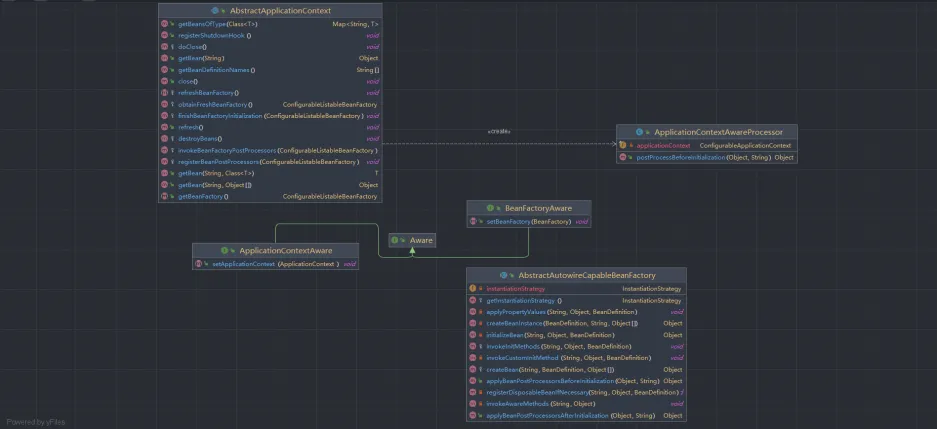
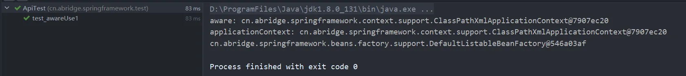
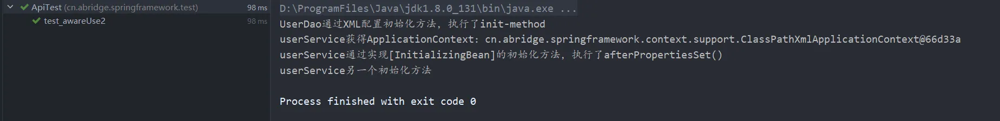

# 第八章、Aware感知接口
## 1 前言
上篇文章我们了解到执行自定义Bean的初始化和销毁方法的两种方式，接下来就到Aware了，这也是一个很重要的一部分，能够让我们在开发中获取到感知的类，例如ApplicationContext等。在开发的时候，经常会遇到在一个不是Bean容器托管的类中需要使用Bean来操作一些东西，因为操作的不在spring上下文中，所以bean是获取不到的，这时候我们就会封装一个Spring上下文的处理器，通过启动应用的时候获取ApplicationContext，再通过调用其getBean方法来实现在非spring上下文中获取bean。那么，这是怎么实现的呢？相信学完本篇文章，对于这种工具类的开发就能够很好的理解。
## 2 思路
`Aware` 是感知、意识到的意思，`Aware`接口是 Spring 框架中一个重要的标记接口，允许 Spring 容器在 Bean 初始化时将特定的框架对象注入到实现了这些接口的 Bean 中。这些接口通常用于让 Bean 感知到 Spring 容器的一些上下文信息，例如应用上下文、Bean 名称、资源加载器等。  <br />在Spring中，存在着许多的`Aware` 接口，他们都有 一个对应的回调方法，用于将相关的框架对象传递给实现了该接口的 Bean 。这章主要是来实现BeanFactoryAware和ApplicationContextAware两个Aware接口。

- 实现BeanFactoryAware比较简单，在接口中定义set方法，向bean实例提供所属工厂的回调。在初始Bean的时候，在执行初始化方法之前去调用Aware方法实现回调。
- 实现ApplicationContextAware则需要通过定义ApplicationContextAwareProcessor去实现BeanPostProcessor，在Bean的生命周期去实例化的时候，会执行前置处理。在刷新容器的时候，去添加一个实现BeanPostProcessor的ApplicationContextAwareProcessor，令其注册到BeanFactory中，在执行前置处理的时候去设置ApplicationContext。
## 3 实践
接下来通过代码的解析来学习，本次使用的demo类的结构如下，代码可以看git的v8分支。
```
cn.abridge.springframework
    ├── beans
    │   ├── BeansException.java
    │   ├── factory
    │   │   ├── Aware.java
    │   │   ├── BeanFactory.java
    │   │   ├── BeanFactoryAware.java
    │   │   ├── config
    │   │   │   ├── AutowireCapableBeanFactory.java
    │   │   │   ├── BeanDefinition.java
    │   │   │   ├── BeanFactoryPostProcessor.java
    │   │   │   ├── BeanPostProcessor.java
    │   │   │   ├── BeanReference.java
    │   │   │   ├── ConfigurableBeanFactory.java
    │   │   │   ├── ConfigurableListableBeanFactory.java
    │   │   │   └── SingletonBeanRegistry.java
    │   │   ├── DisposableBean.java
    │   │   ├── HierarchicalBeanFactory.java
    │   │   ├── InitializingBean.java
    │   │   ├── ListableBeanFactory.java
    │   │   ├── support
    │   │   │   ├── AbstractAutowireCapableBeanFactory.java
    │   │   │   ├── AbstractBeanDefinitionReader.java
    │   │   │   ├── AbstractBeanFactory.java
    │   │   │   ├── BeanDefinitionReader.java
    │   │   │   ├── BeanDefinitionRegistry.java
    │   │   │   ├── CglibSubclassingInstantiationStrategy.java
    │   │   │   ├── DefaultListableBeanFactory.java
    │   │   │   ├── DefaultSingletonBeanRegistry.java
    │   │   │   ├── DisposableBeanAdapter.java
    │   │   │   ├── InstantiationStrategy.java
    │   │   │   └── SimpleInstantiationStrategy.java
    │   │   └── xml
    │   │       └── XmlBeanDefinitionReader.java
    │   ├── PropertyValue.java
    │   └── PropertyValues.java
    ├── context
    │   ├── ApplicationContext.java
    │   ├── ApplicationContextAware.java
    │   ├── ApplicationContextAwareProcessor.java
    │   ├── ConfigurableApplicationContext.java
    │   └── support
    │       ├── AbstractApplicationContext.java
    │       ├── AbstractRefreshableApplicationContext.java
    │       ├── AbstractXmlApplicationContext.java
    │       └── ClassPathXmlApplicationContext.java
    ├── core
    │   ├── io
    │   │   ├── AbstractFileResolvingResource.java
    │   │   ├── AbstractResource.java
    │   │   ├── ClassPathResource.java
    │   │   ├── DefaultResourceLoader.java
    │   │   ├── FileSystemResource.java
    │   │   ├── InputStreamSource.java
    │   │   ├── Resource.java
    │   │   ├── ResourceLoader.java
    │   │   └── UrlResource.java
    │   └── NativeDetector.java
    └── util
        ├── Assert.java
        ├── ClassUtils.java
        ├── CollectionUtils.java
        └── ResourceUtils.java
```
### 3.1 类图

<br />本次涉及的类不多，主要的核心就是标记类`Aware`接口，以及继承这个接口的BeanFactoryAware和ApplicationContextAware两个Aware接口。

- 在BeanFactoryAware接口会定义一个setBeanFactory方法，这个是用来向bean实例提供所属工厂的回调使用。
- 相同，在ApplicationContextAware接口中会定义setApplicationContext，用来设置该对象运行的ApplicationContext。
### 3.2 定义Aware接口
首先是需要定义Aware标记接口，里面并没有什么内容，指示bean有资格通过回调样式的方法由特定框架对象的Spring容器通知，后续会通过`instanceof`来判断。
```java
public interface Aware {
}
```
### 3.3 定义BeanFactoryAware
实现该接口是为了能够感知所属于BeanFactory。
```java
public interface BeanFactoryAware extends Aware {
    /**
     * 向bean实例提供所属工厂的回调。
     * <p>在填充普通的属性的时候调用，但是是在初始化之前，例如：在执行{@link InitializingBean#afterPropertiesSet()}
     * 或者是自定义的init-method方法</p>
     * @param beanFactory bean工厂
     * @throws BeansException 异常
     */
    void setBeanFactory(BeanFactory beanFactory) throws BeansException;
}
```
BeanFactoryAware允许实现该接口的 Bean 在初始化时获得创建它们的 BeanFactory 实例。通过获取 BeanFactory，Bean 可以在运行时动态地访问和操作其他 Bean。<br />如果需要获取BeanFactory，可以通过实现BeanFactoryAware#setBeanFactory，就能够得到BeanFactory，在做其他操作。
### 3.4 定义ApplicationContextAware
接口可以被任何对象实现，能够感知ApplicationContext。
```java
public interface ApplicationContextAware extends Aware {
    /**
     * 设置该对象运行的ApplicationContext。通常，这个调用将用于初始化对象
     * @param applicationContext 该对象要使用的ApplicationContext对象
     * @throws BeansException 异常
     */
    void setApplicationContext(ApplicationContext applicationContext) throws BeansException;
}
```
通过实现ApplicationContextAware接口，能够得到所属的ApplicationContext，就能够对Spring上下文做一些操作。
### 3.5 定义处理器ApplicationContextAwareProcessor
`ApplicationContextAwareProcessor` 的前置处理是为了确保在 Spring 容器完全初始化一个 Bean 之前，将必要的上下文信息注入到实现了 `Aware` 接口的 Bean 中。这种设计保证了 Bean 在被使用前已经完全准备好，拥有了它所需的上下文信息，如 `ApplicationContext`、`BeanFactory` 等。这是 Spring 容器管理和依赖注入的重要机制，确保 Bean 在生命周期的正确时刻获得所有所需的依赖。  
```java
public class ApplicationContextAwareProcessor implements BeanPostProcessor {
    private final ConfigurableApplicationContext applicationContext;

    public ApplicationContextAwareProcessor(ConfigurableApplicationContext applicationContext) {
        this.applicationContext = applicationContext;
    }

    @Override
    public Object postProcessBeforeInitialization(Object bean, String beanName) throws BeansException {
        if (bean instanceof ApplicationContextAware) {
            ((ApplicationContextAware) bean).setApplicationContext(applicationContext);
        }
        return bean;
    }
}
```

> 因为ApplicationContext不能在创建Bean的时候就获取，而是在刷新容器refresh()方法中，将bean工厂添加一个新的BeanPostProcessor，执行注册Bean实例化前的处理器，直到createBean的时候，执行前置处理。

当 Spring 容器在创建和初始化 Bean 时，ApplicationContextAwareProcessor 会在 Bean 被完全初始化之前被调用。这个处理器会检查 Bean 是否实现了某个 Aware 接口，并在需要时调用相应的回调方法。例如，如果一个 Bean 实现了 ApplicationContextAware 接口，ApplicationContextAwareProcessor 会调用该 Bean 的 setApplicationContext 方法，并传递当前的 ApplicationContext 实例。	
### 3.6 回调感知方法
BeanFactoryAware实在初始化Bean的时候进行调用。
```java
public abstract class AbstractAutowireCapableBeanFactory extends AbstractBeanFactory
        implements AutowireCapableBeanFactory {
    // ...
    @Override
    protected Object createBean(String beanName, BeanDefinition mbd, Object... args) throws BeansException {
        // ...
        // 执行bean的初始化方法和BeanPostProcessor的前置和后置处理方法
        initializeBean(beanName, bean, mbd);
    }

    private Object initializeBean(String beanName, Object bean, BeanDefinition mbd) {
        invokeAwareMethods(beanName, bean);
        Object wrappedBean = applyBeanPostProcessorsBeforeInitialization(bean, beanName);
        // 在此处执行bean的初始化方法
        try {
            invokeInitMethods(beanName, wrappedBean, mbd);
        } catch (Throwable ex) {
            throw new BeansException("调用bean [" + beanName + "] 初始化方法失败", ex);
        }
        wrappedBean = applyBeanPostProcessorsAfterInitialization(bean, beanName);
        return wrappedBean;
    }

    /**
     * 回调感知方法
     * @param beanName bean名称
     * @param bean bean
     */
    private void invokeAwareMethods(String beanName, Object bean) {
        if (bean instanceof Aware) {
            // 其他感知的设置
            if (bean instanceof BeanFactoryAware) {
                ((BeanFactoryAware) bean).setBeanFactory(AbstractAutowireCapableBeanFactory.this);
            }
        }
    }
}
```
在初始化之前会进行判断Bean是否为Aware，执行对应的感知方法，BeanFactoryAware会在此处进行回调。
```java
public abstract class AbstractApplicationContext extends DefaultResourceLoader
        implements ConfigurableApplicationContext {

    @Override
    public void refresh() throws BeansException, IllegalStateException {
        // 实现刷新容器
        ConfigurableListableBeanFactory beanFactory = obtainFreshBeanFactory();
        // 添加ApplicationContextAwareProcessor，让继承自ApplicationContextAware的bean能感知bean
        beanFactory.addBeanPostProcessor(new ApplicationContextAwareProcessor(this));
        // 注册Bean实例化前的处理器
        invokeBeanFactoryPostProcessors(beanFactory);
        // 注册Bean前后置处理器
        registerBeanPostProcessors(beanFactory);
        // 实例化所有剩余的（非延迟初始化）单例。
        finishBeanFactoryInitialization(beanFactory);
    }
}
```
ApplicationContext需要在刷新容器的时候，将处理器放到bean工厂中，等到创建bean的时候，填充好属性，会统一执行bean的前置处理，这时候会为实现ApplicationContextAware接口的Bean进行执行回调。
## 4 测试
### 4.1 定义Bean：AwareTestBean
先准备一个Bean：AwareTestBean，令其实现了ApplicationContextAware与BeanFactoryAware，再用成员变量将其保存起来。
```java
public class AwareTestBean implements ApplicationContextAware, BeanFactoryAware {
    private ApplicationContext applicationContext;
    private BeanFactory beanFactory;
    @Override
    public void setBeanFactory(BeanFactory beanFactory) throws BeansException {
        this.beanFactory = beanFactory;
    }

    @Override
    public void setApplicationContext(ApplicationContext applicationContext) throws BeansException {
        this.applicationContext = applicationContext;
    }

    public ApplicationContext getApplicationContext() {
        return applicationContext;
    }

    public BeanFactory getBeanFactory() {
        return beanFactory;
    }
}
```
### 4.2 XML配置
```xml
<?xml version="1.0" encoding="UTF-8"?>
<beans xmlns="http://www.springframework.org/schema/beans"
  xmlns:xsi="http://www.w3.org/2001/XMLSchema-instance"
  xmlns:context="http://www.springframework.org/schema/context"
  xsi:schemaLocation="http://www.springframework.org/schema/beans
  http://www.springframework.org/schema/beans/spring-beans.xsd
  http://www.springframework.org/schema/context
  http://www.springframework.org/schema/context/spring-context-4.0.xsd">

  <bean id="awareTestBean" class="cn.abridge.springframework.test.bean.AwareTestBean"/>
</beans>
```
### 4.3 测试方法
```java
@Test
public void test_awareUse1() throws IOException {
    String beanName = "awareTestBean";
    ClassPathXmlApplicationContext applicationContext = new ClassPathXmlApplicationContext("classpath:spring.xml");
    AwareTestBean bean = applicationContext.getBean(beanName, AwareTestBean.class);
    ApplicationContext app = bean.getApplicationContext();
    System.out.println("aware: " + app);
    System.out.println("applicationContext: " + applicationContext);
    System.out.println(bean.getBeanFactory());
}
```
我们通过观察这两个输出的对象，可以发现app与applicationContext是同一个对象。<br />

### 4.4 回调时机
ApplicationContextAware在什么时候回调呢？
> ApplicationContextAware 接口的回调方法 setApplicationContext(ApplicationContext applicationContext) 是在 Spring 容器完成了 Bean 的实例化和依赖注入之后、但在任何初始化回调方法（如 @PostConstruct 注解的方法或实现 InitializingBean 接口的 afterPropertiesSet 方法）之前调用的。

我们可以通过一个案例来看一下。<br />在上篇文章中的UserService中，我们再来实现ApplicationContextAware。
```java
public class UserService implements InitializingBean, DisposableBean, ApplicationContextAware {
    // ...
    
    @Override
    public void setApplicationContext(ApplicationContext applicationContext) throws BeansException {
        System.out.println("userService获得ApplicationContext：" + applicationContext);
    }
}
```
XML文件也需要做一些改变
```xml
<?xml version="1.0" encoding="UTF-8"?>
<beans xmlns="http://www.springframework.org/schema/beans"
  xmlns:xsi="http://www.w3.org/2001/XMLSchema-instance"
  xmlns:context="http://www.springframework.org/schema/context"
  xsi:schemaLocation="http://www.springframework.org/schema/beans
  http://www.springframework.org/schema/beans/spring-beans.xsd
  http://www.springframework.org/schema/context
  http://www.springframework.org/schema/context/spring-context-4.0.xsd">

  <bean id="awareTestBean" class="cn.abridge.springframework.test.bean.AwareTestBean"/>


  <bean id="userDao" class="cn.abridge.springframework.test.bean.UserDao" init-method="initDataMethod" destroy-method="destroyDataMethod"/>

  <bean id="userService" class="cn.abridge.springframework.test.bean.UserService" init-method="initDataMethod" destroy-method="destroyDataMethod">
    <property name="id" value="1"/>
    <property name="userDao" ref="userDao"/>
    <property name="address" value="浙江杭州"/>
    <property name="tel" value="86-0571"/>
  </bean>
</beans>
```
进行测试查看结果
```java
@Test
public void test_awareUse2() throws IOException {
    String beanName = "userService";
    ClassPathXmlApplicationContext applicationContext = new ClassPathXmlApplicationContext("classpath:spring.xml");
    Object bean = applicationContext.getBean(beanName);
}

```
我们可以通过观察一下输出，userService会先执行setApplicationContext，再去执行初始化方法。<br />

<br />ApplicationContextAware 的 setApplicationContext 方法是在 Spring 容器完成 Bean 的实例化和依赖注入后、初始化方法之前调用的。这一机制确保了 Bean 可以在其生命周期的早期阶段访问 ApplicationContext，从而在需要时使用它来完成进一步的初始化或执行其他操作。
## 5 总结
本篇文章是对Awear的实现进行了介绍，一步一步完善Bean的生命周期，通过本章的学习，也就能够了解开头所说的，我们就能够理解如何封装一个Spring上下文的处理器，通过启动应用的时候获取ApplicationContext，再通过调用其getBean方法来实现在非spring上下文中获取bean。
