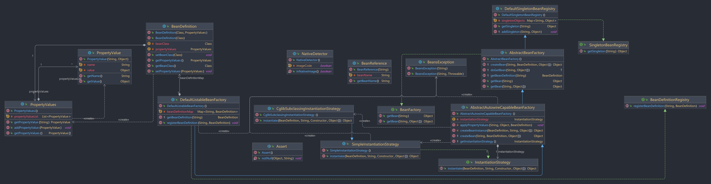
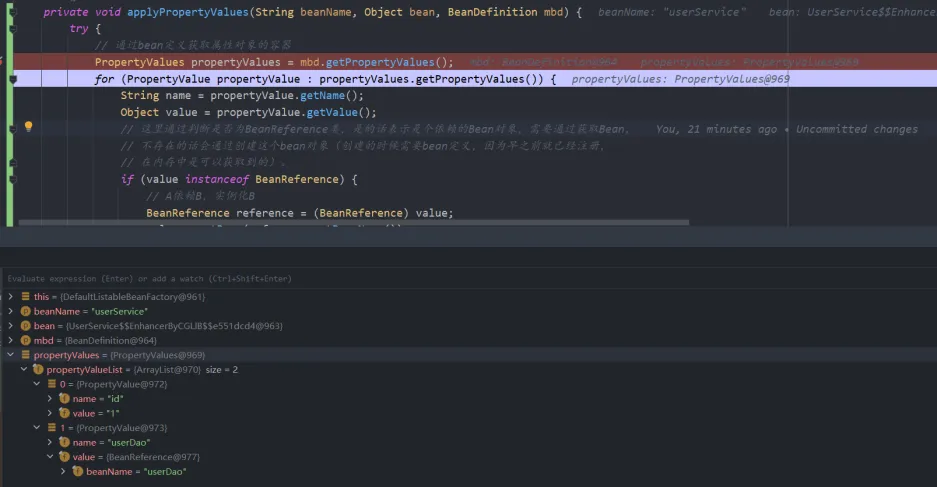

# 第四章、Bean填充属性与注入依赖
## 一、前言
在第三章中，采用了策略模式，使用了jdk和cglib两种方式实现了bean对象的实例化，以及含参构造的实例化，但是Bean对象的属性不只是int、long、String 这些类型，可能是另一个所依赖的Bean对象。因此这章就来接着学习给Bean对象填充属性并注入依赖，但是这章是不能够解决循环依赖的问题，我们先简单的实现。学习方式依旧如此，可以打开Spring5.x的源码对照学习。
## 二、思路
首先需要将Bean对象所需要的属性存放到`PropertyValues`对象中，这个对象里面可能会包含着多个`PropertyValue`对象，也就是存储**属性名-属性值**。在创建实例化Bean之后，会通过反射的方式，将Bean的属性附上值。我们通过`BeanReference`类来标记所依赖的bean对象，通过`value instanceof BeanReference`来判断，如果是的话就会去获取bean对象，因为采用单例模式，因此这里会通过之前的方式，先到单例池获取对象，拿不到在走之前的实例化方式。
### 1 前置知识
#### 1.1 PropertyValue
`PropertyValue`类在 Spring 框架中代表了 Bean 属性的一个“键-值”对。简单地说，它存储了Bean中一个属性的名称（键）以及希望设定的该属性的值（值）。<br />这个类在 Spring IoC 容器的属性注入过程中扮演着重要的角色。当 Spring IoC 容器初始化一个 Bean 的时候，它会通过解析 Bean 定义信息中的 PropertyValues 来获取每一个待注入属性及其对应的值（封装在 PropertyValue中）。然后，通过反射机制设定 Bean 实例中相应的属性。
> 要注意的是，对于 PropertyValue类来说，value 部分不一定就是最终被注入的实际值，它可能是一个对另一个 Bean 的引用，或者一个内联的集合，或者其他类型的值。如果值是一个运行时的引用，那么在进行实际的依赖注入的时候，Spring IoC 容器需要解析这个引用。

#### 1.2PropertyValues
在 Spring 框架中，PropertyValues 接口定义了操作属性值的方法。属性值经常作为 Bean 定义的一部分使用，提供给 Bean Factory 进行组装 Bean 对象。在 Spring 框架中，PropertyValues 是用来抽象应用到一个新实例对象的操作的，它允许在 Bean 工厂中对 Property 进行批量操作。
> PropertyValues 就相当于是 Bean 中属性与值的集合，Spring IOC 容器会通过这个属性列表，反射的方式实现对 Bean 属性的依赖注入。

## 三、实践
本次使用的demo类的结构如下，代码可以看git的v4分支
```text
java
└─cn.abridge.springframework
    ├─beans
    │  ├─BeansException.class
    │  ├─PropertyValue.class
    │  ├─PropertyValues.class
    │  │  
    │  └─factory
    │      ├─BeanFactory.class
    │      │  
    │      ├─config
    │      │      BeanDefinition.class
    │      │      BeanReference.class
    │      │      SingletonBeanRegistry.class
    │      │      
    │      └─support
    │           ├─AbstractAutowireCapableBeanFactory.class
    │           ├─AbstractBeanFactory.class
    │           ├─BeanDefinitionRegistry.class
    │           ├─CglibSubclassingInstantiationStrategy$1.class
    │           ├─CglibSubclassingInstantiationStrategy.class
    │           ├─DefaultListableBeanFactory.class
    │           ├─DefaultSingletonBeanRegistry.class
    │           ├─InstantiationStrategy.class
    │           └─SimpleInstantiationStrategy.class
    │              
    ├─core
    │  └─NativeDetector.class
    │      
    └─util
       └─Assert.class
```
### 1 类图
如图所示，本次实现的案例的类图<br />

<br />这次的代码变动不大，对比上次代码的变动，就是增加了PropertyValue,PropertyValues,BeanReference三个类，以及在实例化对象的之后，会通过反射根据PropertyValue的key-value来给Bean对象进行属性填充，如果是依赖的其他Bean对象，会获取此bean对象。
> 逻辑思想很简单，简单来讲就是，将Bean对象的属性名和属性值注册到PropertyValues->propertyValueList数组中，等实例化后，通过反射（这里采用Hutool工具包）进行填充。

### 2 Bean引用
需要提供一个类(BeanReference)用来标记这个属性值是个Bean依赖，需要获取所依赖的Bean对象。
```java
package cn.abridge.springframework.beans.factory.config;

/**
 * @Author: lyd
 * @Date: 2024/3/28 22:24
 * @Description: Bean引用
 * <p>这里就是简单实现构造方式设置bean名称，通过getBeanName获取依赖的bean名称。</p>
 * <p>在Spring源码中是以抽象方式公开对 bean 名称的引用的接口。此接口不一定意味着对实际 bean 实例的引用；
 * 它只是表达对 bean 名称的逻辑引用。</p>
 */
public class BeanReference {

    private final String beanName;

    public BeanReference(String beanName) {
        this.beanName = beanName;
    }

    public String getBeanName() {
        return beanName;
    }
}

```
这里就是简单实现构造方式设置bean名称，通过getBeanName获取依赖的bean名称。
> 在Spring源码中，他是以抽象方式公开对 bean 名称的引用的接口。此接口不一定意味着对实际 bean 实例的引用，它只是表达对 bean 名称的逻辑引用。

### 3 Bean属性的定义
提供一个类(`PropertyValue`)用来存储Bean对象的属性信息。
```java
package cn.abridge.springframework.beans;

import cn.abridge.springframework.util.Assert;
import com.sun.istack.internal.Nullable;

/**
 * @Author: lyd
 * @Date: 2024/3/28 21:45
 * @Description: 存储单个bean属性的信息和值
 */
public class PropertyValue {
    private final String name;

    @Nullable
    private final Object value;

    public PropertyValue(String name, @Nullable Object value) {
        Assert.notNull(name, "名称一定不能为空");
        this.name = name;
        this.value = value;
    }
    // get...
}

```
一个Bean对象中，可能会包含着多个属性，因此需要一个集合来存储多个属性。即`PropertyValues`。
```java
package cn.abridge.springframework.beans;

import java.util.ArrayList;
import java.util.List;

/**
 * @Author: lyd
 * @Date: 2024/3/28 21:52
 * @Description: Bean的属性值
 * 包含一个或多个 {@link PropertyValue} 对象的容器，通常包括针对特定目标 bean 的一次更新。
 * 这里与源码不同，源码中是个接口，由子类 {@code MutablePropertyValues} 来实现此接口，
 * 并且继承了Iterable<PropertyValue>。
 */
public class PropertyValues {
    /**
     * 存放属性值
     */
    private final List<PropertyValue> propertyValueList = new ArrayList<>();

    /**
     * 返回该对象中包含的PropertyValue对象的数组
     */
    public PropertyValue[] getPropertyValues() {
        return this.propertyValueList.toArray(new PropertyValue[0]);
    }

    /**
     * 如果存在值，返回具有给定名称的属性值
     * @param propertyName 属性名
     * @return 属性值 或者 {@code null}
     */
    public PropertyValue getPropertyValue(String propertyName) {
        for (PropertyValue pv : this.propertyValueList) {
            if (pv.getName().equals(propertyName)) {
                return pv;
            }
        }
        return null;
    }

    /**
     * 将属性对象存入集合
     * @param pv 属性
     */
    public void addPropertyValue(PropertyValue pv) {
        this.propertyValueList.add(pv);
    }
}

```
定义一个集合`List<PropertyValue> propertyValueList`来存储Bean对象的所有属性信息。
### 4 Bean定义设置属性对象
在Bean定义中，需要补全属性值，在构造函数中，提供传入属性对象容器，并进行赋值。
```java
package cn.abridge.springframework.beans.factory.config;

import cn.abridge.springframework.beans.PropertyValues;

/**
 * @Author: lyd
 * @Date: 2024/3/19 20:40
 * @Description: bean定义，具有属性值、构造函数参数值。
 */
public class BeanDefinition {
    private Class beanClass;

    private PropertyValues propertyValues;

    public BeanDefinition(Class beanClass) {
        this.beanClass = beanClass;
        this.propertyValues = new PropertyValues();
    }

    public BeanDefinition(Class beanClass, PropertyValues propertyValues) {
        this.beanClass = beanClass;
        this.propertyValues = propertyValues != null ? propertyValues : new PropertyValues();
    }
    // get/set ...
}

```
### 5 Bean属性填充与依赖注入
提供填充属性的方法，在AbstractAutowireCapableBeanFactory#applyPropertyValues(...)。
```java
private void applyPropertyValues(String beanName, Object bean, BeanDefinition mbd) {
    try {
        // 通过bean定义获取属性对象的容器
        PropertyValues propertyValues = mbd.getPropertyValues();
        for (PropertyValue propertyValue : propertyValues.getPropertyValues()) {
            String name = propertyValue.getName();
            Object value = propertyValue.getValue();
            // 这里通过判断是否为BeanReference类，是的话表示是个依赖的Bean对象，需要通过获取Bean，
            // 不存在的话会通过创建这个bean对象（创建的时候需要bean定义，因为早之前就已经注册，
            // 在内存中是可以获取到的）。
            if (value instanceof BeanReference) {
                // A依赖B，实例化B
                BeanReference reference = (BeanReference) value;
                value = getBean(reference.getBeanName());
            }
            // 通过反射来实现填充属性 （BeanUtil: Hutool工具包下的方法）
            BeanUtil.setFieldValue(bean, name, value);
        }
    } catch (Exception e) {
        throw new BeansException("Bean " + beanName + " 设置属性值错误");
    }
}
```
当Bean对象实例化之后，通过反射进行属性填充。通过Bean定义获取属性集合，遍历集合，将属性一个一个填充，如果是依赖的Bean对象，在进行Bean对象的获取或实例化。最后通过反射来为Bean对象进行填充属性。
> 这里需要注意的是，这样的操作是不能够解决循环依赖的。

## 四、测试
### 1 测试的方法
提供UserService和UserDao两个类，UserService依赖UserDao。
```java
public class UserService {
    private String id;

    private UserDao userDao;

    public void getUserInfo(){
        System.out.println("执行中。。。");
        System.out.println(userDao.queryUserId(id));
    }
}
```
测试方法
```java
@Test
public void test_PropertyIntoBeanObject() {
    System.out.println("测试属性填充和依赖注入");
    String beanName = "userService";
    String userDaoBeanName = "userDao";
    // 1、初始化BeanFactory
    DefaultListableBeanFactory beanFactory = new DefaultListableBeanFactory();
    // 2、注册依赖的bean定义
    beanFactory.registerBeanDefinition(userDaoBeanName, new BeanDefinition(UserDao.class));
    // 2.1、属性注入
    PropertyValues propertyValues = new PropertyValues();
    propertyValues.addPropertyValue(new PropertyValue("id", "1"));
    propertyValues.addPropertyValue(new PropertyValue(userDaoBeanName, new BeanReference(userDaoBeanName)));
    // 2.2、注册bean定义
    BeanDefinition beanDefinition = new BeanDefinition(UserService.class, propertyValues);
    beanFactory.registerBeanDefinition(beanName, beanDefinition);
    // 3、获取bean
    UserService bean = (UserService) beanFactory.getBean(beanName);
    bean.getUserInfo();
    System.out.println("UserService的bean对象：" + bean);
    System.out.println("UserService的bean的dao对象：" + bean.getUserDao());
}
```
UserDao是被依赖的Bean对象，因此需要将其Bean定义注册到容器里面，对于UserService，将里面的属性key-value注入属性信息容器，用BeanReference类来标记其是个依赖的Bean对象。在实例化Bean定义的时候，会将对应的属性信息容器(PropertyValues)注入到Bean定义中，接着注册Bean定义，获取Bean对象，执行查询用户信息方法。
### 2 运行与调试
在实例化UserService对象的时候，会根据定义中的属性信息容器，去将对应的属性一个一个进行赋值。<br />

<br />接着通过反射进行填充属性`BeanUtil.setFieldValue(bean, name, value);`<br />运行结果
```text
测试属性填充和依赖注入
执行中。。。
怒放吧德德
UserService的bean对象：cn.abridge.springframework.test.bean.UserService$$EnhancerByCGLIB$$e551dcd4@4148db48
UserService的bean的dao对象：cn.abridge.springframework.test.bean.UserDao$$EnhancerByCGLIB$$66087af3@282003e1
```
## 五、总结
通过这章的学习，更加的完善了Bean对象的实例化。简单理解就是，在Bean定义中，提供了一个属性容器，用来存储Bean对象的属性信息，等对象实例化之后，会根据对应Bean的属性容器中所对应的类型来进行填充，这里会判断如果是BeanReference类型，就会调用getBean()，通过单例池获取，拿不到则创建，如果这个对象还有属性，也会进行填充。虽然本次看似完成了对Bean的实例化，但实际上会存在着循环依赖的问题，这次并没有解决，后续学习将会get到。
## 六、参考文献

- [mini-spring](https://github.com/DerekYRC/mini-spring)
- [小傅哥虫洞栈](https://bugstack.cn/)
- [Spring5.x框架源码](https://github.com/spring-projects/spring-framework)
